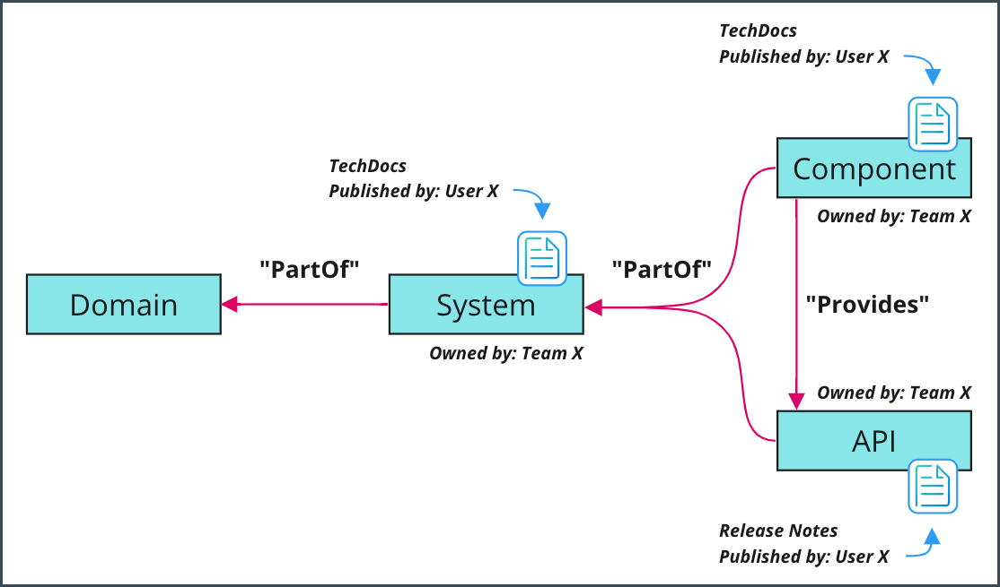

## Updating Your Entities

As your project changes and grows, you can update your Systems, Components, and APIs to reflect your new entities.

The information displayed in XELERATE is controlled by the entity file that you imported when you first created the entity/entities. 

To update your entities, simply make the necessary changes to your entity file. 

Once you commit those changes and merge them to your main branch, XELERATE will automatically detect the changes and update the entities in its software catalog.


### Update example

For example, you may have originally created your System with a lifecycle value of `in-development`. 

If you have since completed a general availability (GA) release into production, you can edit your catalog file, find the entity with `kind: system` and `name:` matching your entity name. 

Locate its `spec.lifecycle` entry and change the value from `in-development` to `production`. 

Commit this change into your main branch. 

XELERATE will update to reflect the new information within 90 seconds or so.

If you are unsure how to find your catalog file, [follow these steps to find the location](faq.md#Where-do-I-find-my-catalog-file?) of the entity file that is managing your entities.


## Adding Addition Entities

You can add additional Components and APIs to your project by creating new entity entries in your catalog file. 

Each entity is separated by a line containing `---`. 

There is no limit to the number of entities that can be stored in a single Catalog Info file. 

Likewise, large teams may choose to create multiple Catalog Info files to better separate and manage ownership and oversight of the many elements of their service(s). There is no limit to the number of entity YAML files you can publish. And any entity in any YAML file can refer to (and be associated with) any other entity in any other YAML file (even ones owned by other teams).

For example, a catalog file containing one component and one API may look like this:

```yaml
---
apiVersion: backstage.io/v1alpha1
kind: Component
spec:
  type: service
  owner: frobs-team
  lifecycle: in-development
metadata:
  name: frobs-management-project

--- # dashes separate the each entity in the same file
apiVersion: backstage.io/v1alpha1
kind: API
spec:
  type: openapi
  owner: frobs-data-team
  lifecycle: production
  definition:
    $text: ./spec/data-api-swagger.yaml
metadata:
  name: frobs-data-api
```

Once you have added the new entities, commit the change into your main branch. 

XELERATE will automatically update to reflect the new information, usually within 90 seconds.


## GitHub CI/CD
To enable the CI/CD tab for a GitHub project, add a `github.com/project-slug` annotation to your project.

``` yaml
metadata:
  name: frobs-management-project
  annotations:
    github.com/project-slug: cariad-frobs/frobs-management
```

For information on other CI/CD systems, see the [Backstage project documentation](https://backstage.io/docs/features/software-catalog/well-known-annotations).


## Relationships Between Components

XELERATE will not automatically infer any connection or relationship between two entities found in the same catalog file. 

You must explicitly declare any desired interrelationships. 

Relationships can be configured between entities within the same catalog file, or to external entities added into XELERATE from other sources.

### Types of relationships

Backstage supports relationships that describe how entities interact and depend on each other. 



Below is a brief overview of the main types of relationships used in XELERATE. 

For detailed instructions on how to configure these and other relationships in your project, see the [Backstage project documentation](https://backstage.io/docs/features/software-catalog/descriptor-format).

### API relationships

To mark a component as "providing an API", see the [API Onboarding](api.md#Create-a-relationship-between-API-and-Component) article.

### Consumes API relationship

To mark a component as "consuming an API" provided by some other component, use the `spec.consumesApis` entry.

See: https://backstage.io/docs/features/software-catalog/descriptor-format#specconsumesapis-optional.

### Relationships between components

`spec.subcomponentOf` and `spec.dependsOn` are annotations that can be assigned to components. 

- [SubcomponentOf](https://backstage.io/docs/features/software-catalog/descriptor-format#specsubcomponentof-optional) specifies one other component of which this component is a part.

- [DependsOn](https://backstage.io/docs/features/software-catalog/descriptor-format#specdependson-optional) specifies an array of references to the components that the component depends on.

### System relationship

`spec.system` is an annotation that can be assigned to components and APIs. 

- [System](https://backstage.io/docs/features/software-catalog/descriptor-format#specsystem-optional) specifies a system to which the component or API belongs.

## Region-based access control

As the publisher of an entity, you have the ability to control which CloudIDP Login regions will have visibility of your entities.

The default is for entities to be visible across all regions. 

To restrict an entity to a **single** region, set the `vwcloudio/allowRegion` annotation (see below). Accepted values are `eu/na` and `cn`, corresponding to the shared Europe/North America region and to the China region, respectively.

```yaml
metadata:
  annotations:
    vwcloudio/allowRegion: 'eu/na'
```

!!! note
    There is no exception for entity owners, so you will not be able to use the XELERATE portal to view entities restricted to a different region than the one you are currently signed in with.

For the purposes of entity visibility, a user's region is determined by which identity provider they used when signing into the XELERATE portal.
