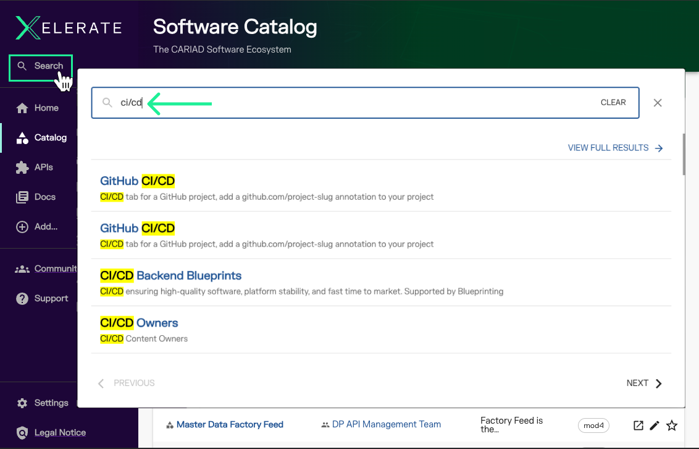
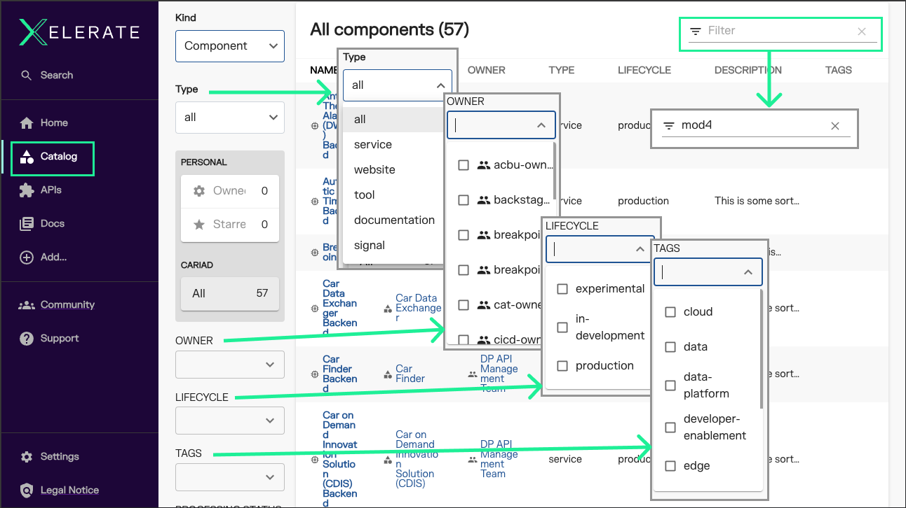
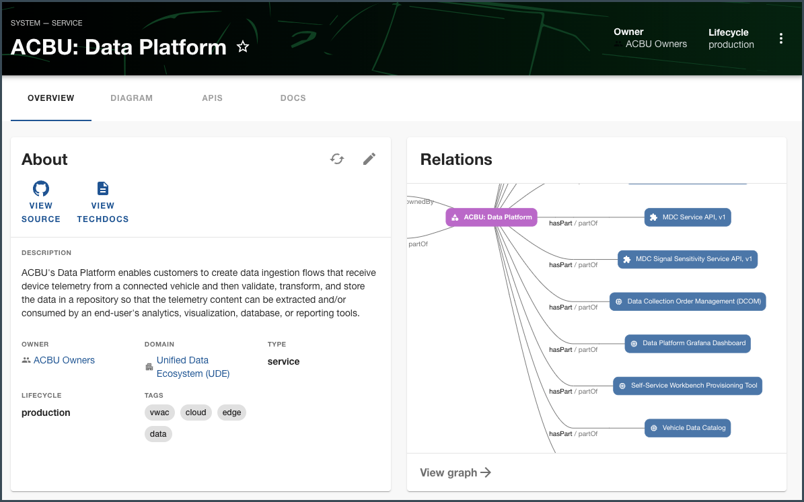
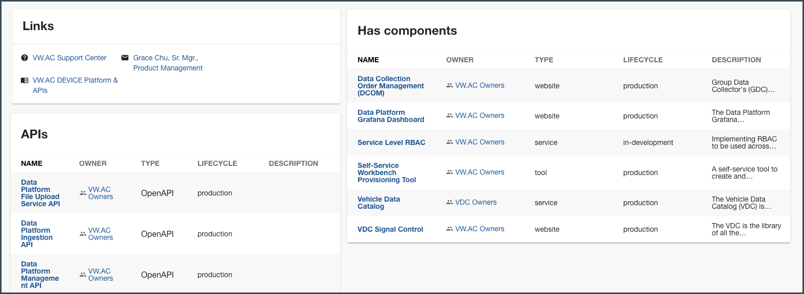

# CARIAD Software Catalog

At the center of XELERATE is the Software Catalog, a dynamic inventory of CARIAD tools and services. 

Each item in the catalog is owned, maintained, and published by the CARIAD team that created it.

## Using the Software Catalog: to Discover

A primary function of the catalog is to make discovery easy. 

Developers across CARIAD (including partners, subsidiaries, and contractors) are able to do their jobs more effectively when software assets are easy to discover, access, and learn. 

Use XELERATE to answer questions like:

- "Does CARIAD publish CI/CD Standards?"

- "Which services support 'MOD4'?"

### Global Search

Start with the **Global Search** and **catalog filtering** tools to help find those answers:

### Catalog filtering

## Using the Software Catalog: As a Development Team

The Software Catalog also assists in getting work done *as a member within a development team*, providing instant access to API specifications, expository guides, related content, and more.

The mental load on developers can be reduced, and the onboarding of new developers accelerated, by providing a robust dashboard with links to the many services, libraries, and websites that a team manages and the resources they depend on. 

Addressing the discoverability problem is intended to drive a virtuous cycle of improved communication as well as engineering and operational excellence. 

For example: by creating well-known ways to reach documentation or view a service's status, teams will be better motivated to write and update documentation or surface the availability of their own services.

## What Belongs in the Software Catalog?

Any piece of CARIAD-flavored software (tool, library, or service, including third-party software for which there are CARIAD subscriptions) that a CARIAD developer would otherwise have to learn about through word-of-mouth.

The goal is to eliminate the knowledge gaps between team members and across disciplines.
