## Publishing Entities

Adding your software, product, or service into the CARIAD Software Catalog starts with publishing one or more entities using a **Catalog Info** file.

Your Catalog Info file:

- Must be in a YAML format
- Should be stored in your team's repo (Azure, GitHub, BitBucket etc.)
- Can be named anything you wish (but `catalog-info.yml` is a good start)
- Needs to be readable by the Backstage App (see below)
- Should conform to best practices (see below)


## Step 1: Create Your Project's Catalog File

You define your entities in a Catalog Info YAML file.

This file is conventionally named `catalog-info.yaml`, and is commonly placed in the root of your Code (or Docs) repo.

!!! note
    For more information and details on the Catalog Info's file format, see the [official Backstage documentation](https://backstage.io/docs/features/software-catalog/descriptor-format).


## Step 2: Add an Entity

For most teams, your project will be defined as an entity of **kind: System**.

!!! info "Important"
    When defining your entity's YAML content, the `kind: Xxxx` entry is the *only* parameter that is case sensitive.

    You must **capitalize** the `kind:` entry exactly as shown below:

    - `kind: System`
    - `kind: Component`
    - `kind: API`

Each entity in your YAML file should start with `---` followed by the required `apiVersion: backstage.io/v1alpha1`.

Below is an example System entity from the **ACBU Connected Vehicle Platform** that can be used as a reference template:

### Example: `catalog-info-acbu-connected-vehicle.yml`

```{.yaml linenums="1"}
---
apiVersion: backstage.io/v1alpha1  # Required
kind: System   # System is the best choice for the initial entity for most teams.
spec:
  type: service  # System types are generally "service" or "documentation"
  owner: acbu-owners  # Work with the Backstage Publishing Team when selecting this. Only Backstage Admins can add new "owners" into the system.
  domain: device-platform  # Associate your System with a Domain (optional)
  lifecycle: in-development  # Change to "production" when ready.
metadata:
  name: vwac  # Work with the Backstage Publishing Team when selecting this. This will be used as the suffix of your “home page” URL.
  title: "ACBU: Connected Vehicle Platform"  # Include a human-readable title. It will be displayed in all Backstage pages.
  description: ACBU's Connected Vehicle Platform includes APIs and AutoEdge services which ...  # Keep to about 50 words +/-.
  annotations:
    backstage.io/techdocs-ref: dir:.  # Only required if you plan to publish Markdown/TechDocs content.
  tags:  # Enter 1-4 appropriate tags to help others search for and find your product/service.
    - vwac
    - cloud
    - edge
  links:  # Links are used to reference ANY & ALL related content, such as: owners, emails, support sites, or other resources.
    - url: https://developer.vwcloud.io/s/support-center
      title: ACBU Support Center
      icon: default
    - url: mailto:john.doe@cariad.us
      title: John Doe, Sr. Mgr., Product Management
      icon: email
    - url:https://developer.cariad.digital/catalog/default/system/vwac-data
      title: ACBU's Data Platform & APIs
      icon: catalog
    - url:https://developer.cariad.digital/catalog/default/component/vv-tool/docs
      title: Virtual Vehicle Documentation
      icon: docs
  labels:  # See the "Labels" article for more info on labels.
    cariad.technology/main-group.cloud: "true"
    cariad.technology/region.nar: "true"
    cariad.technology/region.eu: "true"
    cariad.technology/region.china: "true"
    cariad.technology/region.row: "true"
    cariad.technology/cloud-cat.config-specs: "true"
    cariad.technology/cloud-cat.dev-enablement: "true"
    cariad.technology/cloud-cat.user-info: "true"
```

You can view this **ACBU Connected Vehicle Platform** System in the XELERATE Software Catalog at:https://developer.cariad.digital/catalog/default/system/vwac

### External links

Links to existing resources are the easiest way to let other catalog users learn more about your project.

You can add any number of links under the `metadata.links` section.

Be sure to include:

- A way to contact your team, like a ticketing system or email address.
- Any existing documentation or wikis related to your project.
- You project's web app or homepage, if it exists.

Additional examples of links might include:

- Additional contact methods, especially if your primary contact is not universally accessible.
- Resources that provide context to help visitors understand your project.
- Other projects (outside of XELERATE) with functionality that you extend or depend on.

???+ tip "Link icons"
    In the `metadata.links` section, you can specify an icon to be displayed next to each link. If `icon` is omitted, it will default to the "globe" icon.

    The following icons are available out-of-the-box for you to use:

    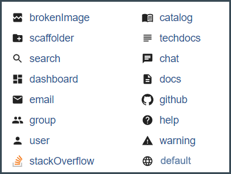


## Step 3: Grant the XELERATE App Access to Your Repo

Your Catalog Info file (e.g.: `catalog-info.yaml`) will generally be stored somewhere within your repository (GitHub, GitHub Enterprise, BitBucket, Azure DevOps, etc.). It can even be stored within a special branch, but we suggest that you place it in your project's root.

The XELERATE App must be able to access your entity file (and any other .yaml or .json files it references, such as Swagger files).

- For [GitHub Repos](#github-enabling-the-cariad-backstage-app-in-a-githubcom-repo), the **Backstage App** needs to be installed into your repo.

- For [ADO Repos](#azure-dev-ops-enabling-the-cariad-backstage-spn-in-an-ado-repo), a **Backstage SPN** needs to be granted read-only access to your repo.

- For [BitBucket Repos](#azure-dev-ops-enabling-the-cariad-backstage-spn-in-an-bitbucket-repo), a **Backstage SPN** needs to be granted read-only access to your repo.

See the proper section below for instructions on providing access based on your specific Repo type.

### GITHUB: Enabling the XELERATE App in a GitHub.com repo

If you are publishing a catalog file from a GitHub.com repo, install the XELERATE App into your GitHub repo by following these steps.

!!! Note
    As of December, 2023, the `cariad-t2` GitHub.com organization has already enabled the XELERATE App for all repositories in its entire Org.

    Users publishing .yaml files from the [cariad-t2 org](https://github.com/cariad-t2) do *not* need to perform the steps below.

!!! info
    This process is fully documented in GitHub's [Registering a GitHub App](https://docs.github.com/en/apps/creating-github-apps/registering-a-github-app/registering-a-github-app) documentation article.

Click on this link to install the XELERATE App into your GitHub repo:

- [Install the **cariad-dxp-backstage** App](https://github.com/apps/cariad-xelerate).

You will need to:

1. Authenticate to your GitHub.com organization.

2. Click the **Configure** button.

  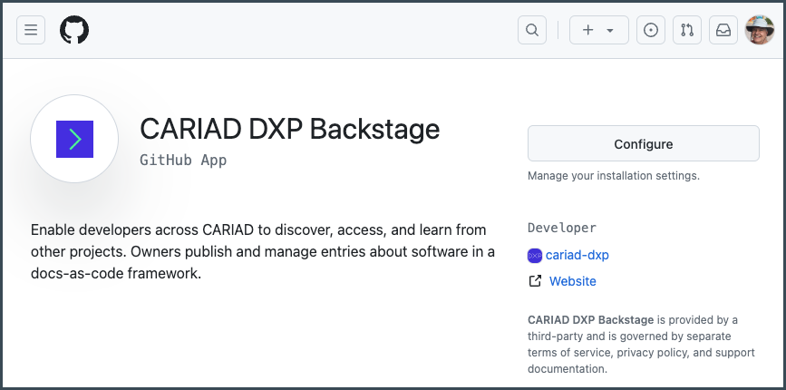

3. Click **Configure >** for the GitHub repo you want to install the XELERATE App in.

  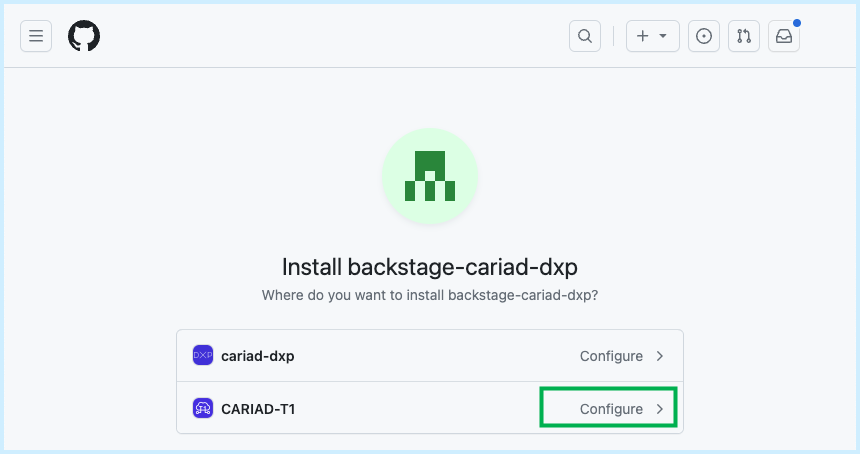

4. Choose your specific repo (or **All repositories**) and click **Install**.

  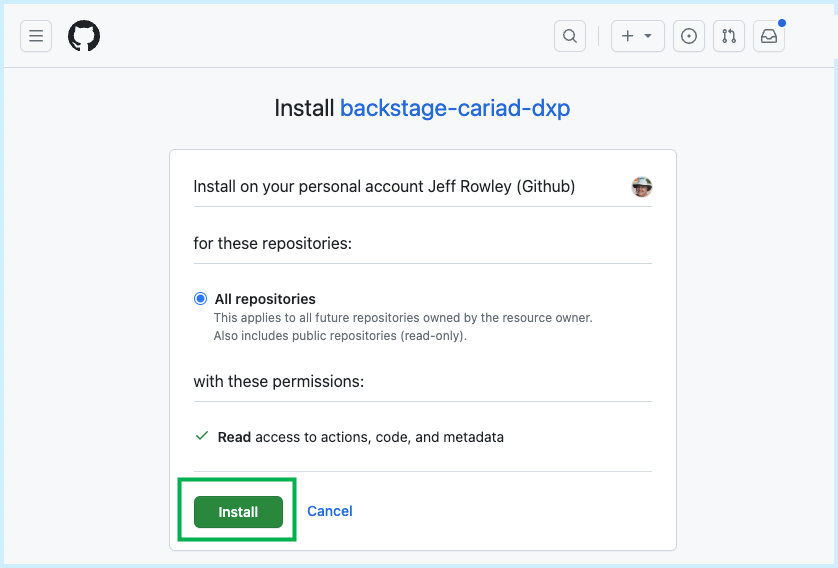

### AZURE DEV OPS: Enabling the XELERATE SPN in an ADO repo

If you are publishing a catalog file from an Azure DevOps repo, allow "View project-level information" and "read-only access" to XELERATE's SPN by following these steps.

**ADO OPTION A: Enabling broad, "project-wide" ADO access:**

!!! note
    If read-only access to your entire project is preferred or beneficial, follow the steps below.

    If a more restricted access is desired, see the next section.

In your project settings, add the Service Principal `vwac-dxp2-cariadinc-devops-prod-spn` to the **Readers** permissions group. This [Service Principal](https://portal.azure.com/#view/Microsoft_AAD_RegisteredApps/ApplicationMenuBlade/~/Overview/appId/956e5244-0323-4a8b-b51a-74a1ce617332) from the [VW.AC Azure DevOps organization](https://dev.azure.com/vwac-ado-mgmt/) is used by XELERATE to access the YAML & JSON files in your repo.

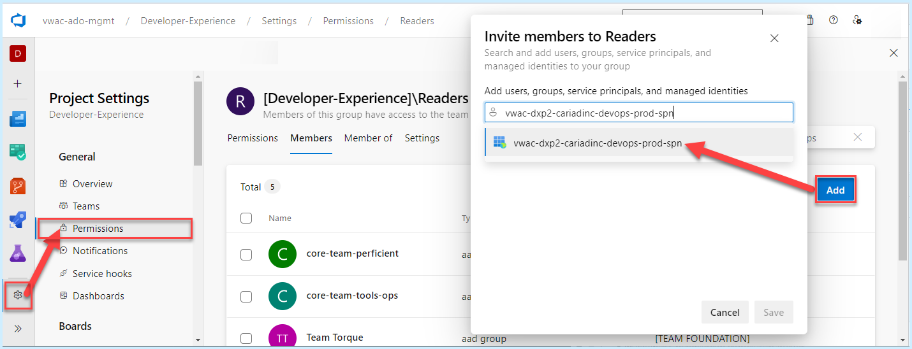

!!! note
    To install the XELERATE SPN in a *different* DevOps organization, please contact the [XELERATE team](./faq.md#contact-information).

**ADO OPTION B: Enabling narrow, "least-privilege" ADO access:**

When a more restricted access is desired or mandated, follow these steps:

1. Open your ADO project and select: "Project Settings" > "Permissions" > "New Group".

  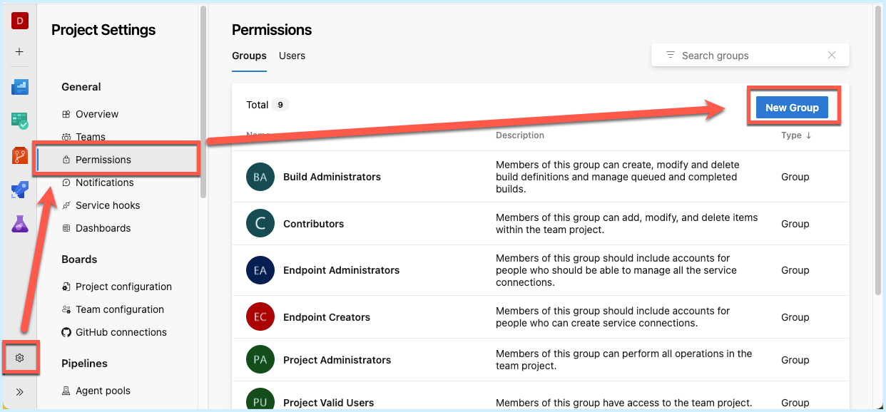

2. Give the new group a name and add `vwac-dxp2-cariadinc-devops-prod-spn` as a member. Click **Create**.

  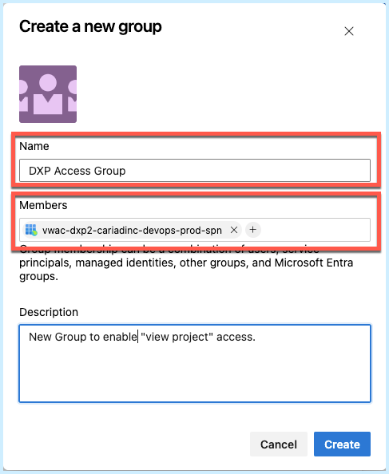

3. Edit the "Permissions" for the new group. Change "View project-level information" to **Allow**.

  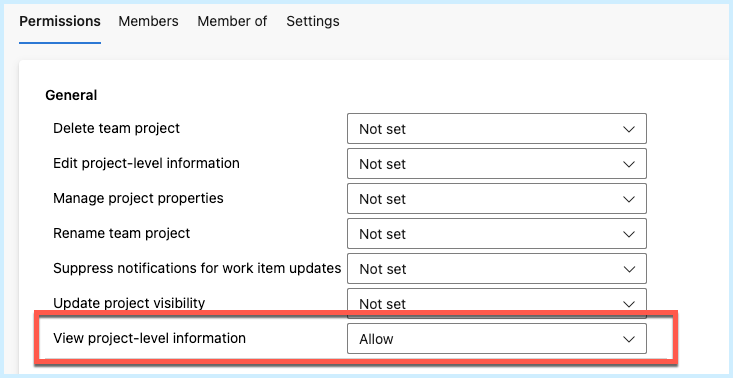

4. Next, click: "Project Settings" > "Repositories". Select your Repo.

  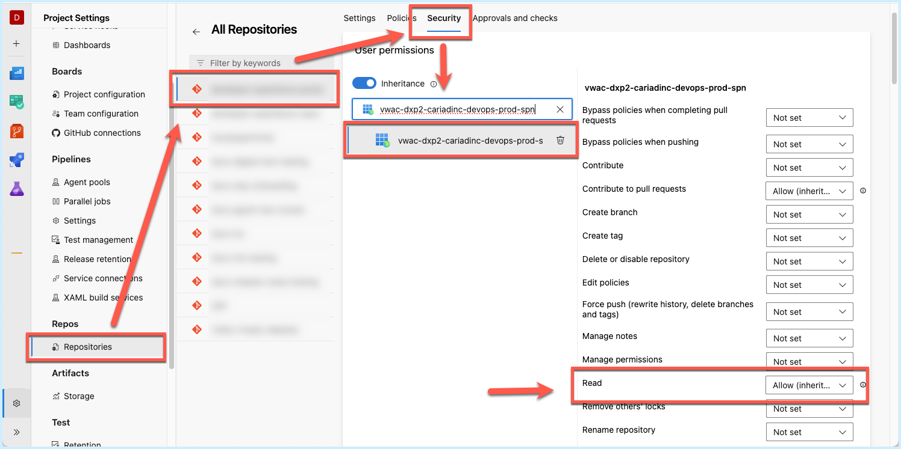

5. Click on the **Security** tab, select the XELERATE's SPN and change "Read" to **Allow**.


### BITBUCKET DEV OPS: Enabling the XELERATE `Systemuser, Xelerate` in an Bitbucket repo

If you are publishing a catalog file from an BitBucket DevOps repo, allow "View project-level information" and "read-only access" to XELERATE's `Systemuser, Xelerate` by following these steps.

In your project repository settings, add `Systemuser, Xelerate` Readers permissions group. This user from the VW.AC gitHub organization is used by XELERATE to access the YAML & JSON files in your repo.

1. Open your BITBUCKET project and select: "Repository settings" > "Repository permissions" > "Add user or group".

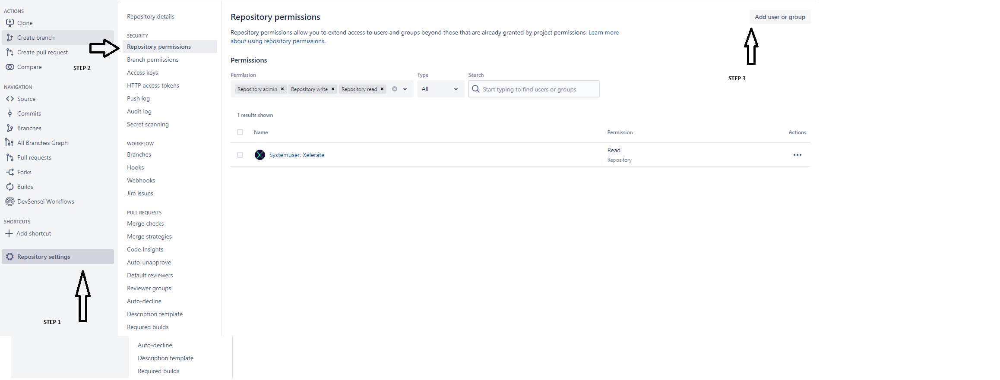

2. Give the new user name and add `Systemuser, Xelerate` as a member. Click **Add**.

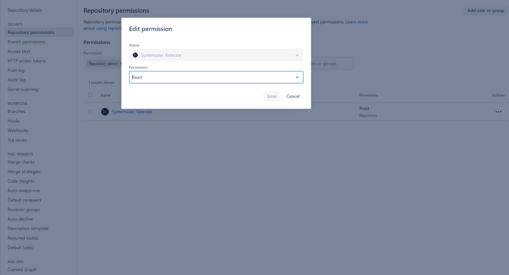

## Step 4: Import Your Project's Entity File

Once you have created and saved your entity file and enabled access for the XELERATE App/SPN in your repo, you can now import your project's catalog file into XELERATE:

1. Navigate to the [Register an existing CARIAD component](/catalog-import) page.

2. In the **Select URL** text box, paste the full URL to your project's entity file.

3. Click the **Analyze** button.

  Resolve any errors or issues before proceeding.

4. Continue through the **Import**, **Review**, and **Finish** steps.

  Once completed, you will see links to the new entities that you just imported.

  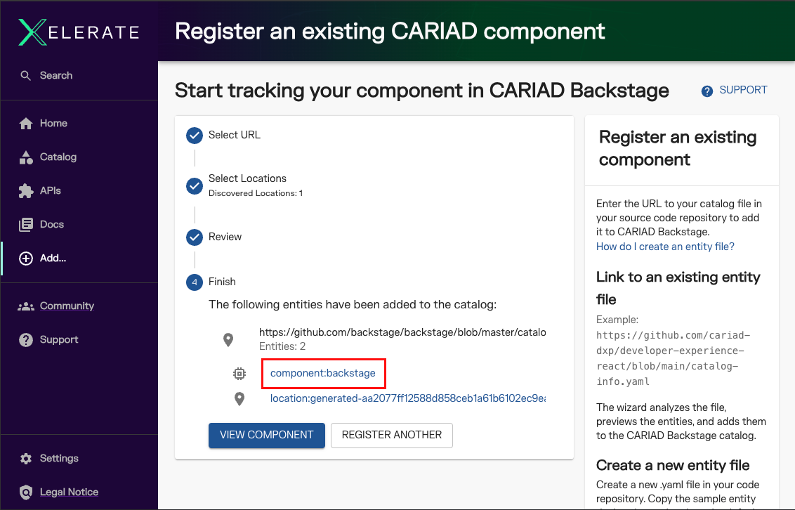


## Step 5: Validate & Update

Ensure your catalog entity is displaying in the XELERATE Software Catalog by navigating to the [Software Catalog](/catalog) and locating your new entity (System, Component, etc.)

Once the entity is visible in the Catalog, you can adjust any attributes or content by editing your YAML file.

XELERATE monitors your catalog file (and any other files it references) for any changes and will automatically import your updates in near-real time (about 90 seconds or less).

No action is required on your part for your catalog entry updates and changes to be automatically ingested and displayed in XELERATE.


## Troubleshooting

!!! warning "Problem: `secretOrPrivateKey` must be an asymmetric key when using RS256"

    When attempting to import your catalog file, an error message appears after you click the "Analyze" button.

    ```json
    {"error":{"name":"InputError","message":"Error: Unable to read url, Error: secretOrPrivateKey must be an asymmetric key when using RS256"},"request" {"method":"POST","url":"/locations?dryRun=true"},"response":{"statusCode":400}}
    ```

    **Solution:**

    The XELERATE App may not have been installed in your repo. Double check "Step 3: Grant the XELERATE App Access to Your Repo" above.


!!! warning "Problem: Client network socket disconnected before secure TLS connection was established"

    When attempting to import your catalog YAML file, an error message appears after you click the "Analyze" button.

    ```json
    {
      "error": {
        "name": "AuthenticationError",
        "message": "Refresh failed; caused by Error: Client network socket disconnected before secure TLS connection was established",
        "cause": {
          "code": "ECONNRESET",
          "path": null,
          "host": "login.windows.net",
          "port": 443,
          "name": "Error",
          "message": "Client network socket disconnected before secure TLS connection was established",
          "stack": "Error: Client network socket disconnected before secure TLS connection was established\n    at connResetException (node:internal/errors:717:14)\n    at TLSSocket.onConnectEnd (node:_tls_wrap:1595:19)\n    at TLSSocket.emit (node:events:525:35)\n    at endReadableNT (node:internal/streams/readable:1359:12)\n    at process.processTicksAndRejections (node:internal/process/task_queues:82:21)"
        }
      },
      "request": { "method": "GET", "url": "/public/auth/oauth2proxy/refresh/" },
      "response": { "statusCode": 401 }
    }
    ```

    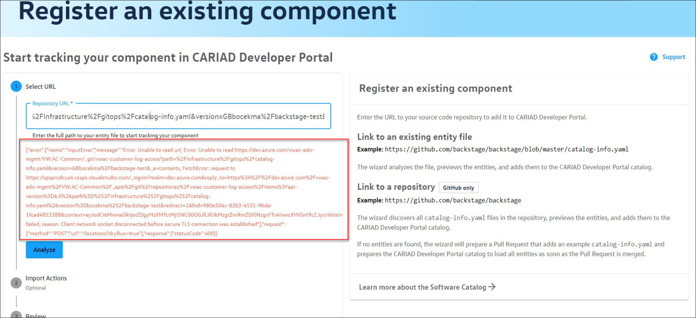

    The domain may be blocked by Megatron (our container hosting provider) preventing XELERATE from reaching your catalog file.

    Contact the [XELERATE team](./faq.md#contact-information) for further assistance.


## Step to Import Your Project's Entity File

Once you have created and saved your entity file and enabled access for the XELERATE App/SPN in your repo, you can now import your project's catalog file into XELERATE:

1. Navigate to the [Register an existing CARIAD component](/catalog-import) page.

2. In the **Select URL** text box, paste the full URL to your project's entity file.

3. Click the **Analyze** button.

  Resolve any errors or issues before proceeding.

4. Continue through the **Import**, **Review**, and **Finish** steps.

  Once completed, you will see links to the new entities that you just imported.

  


## Validate & Update

Ensure your catalog entity is displaying in the XELERATE Software Catalog by navigating to the [Software Catalog](/catalog) and locating your new entity (System, Component, etc.)

Once the entity is visible in the Catalog, you can adjust any attributes or content by editing your YAML file.

XELERATE monitors your catalog file (and any other files it references) for any changes and will automatically import your updates in near-real time (about 90 seconds or less).

No action is required on your part for your catalog entry updates and changes to be automatically ingested and displayed in XELERATE.
