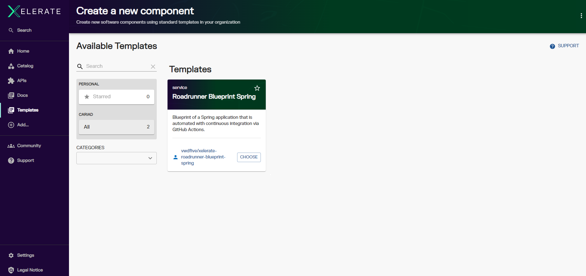
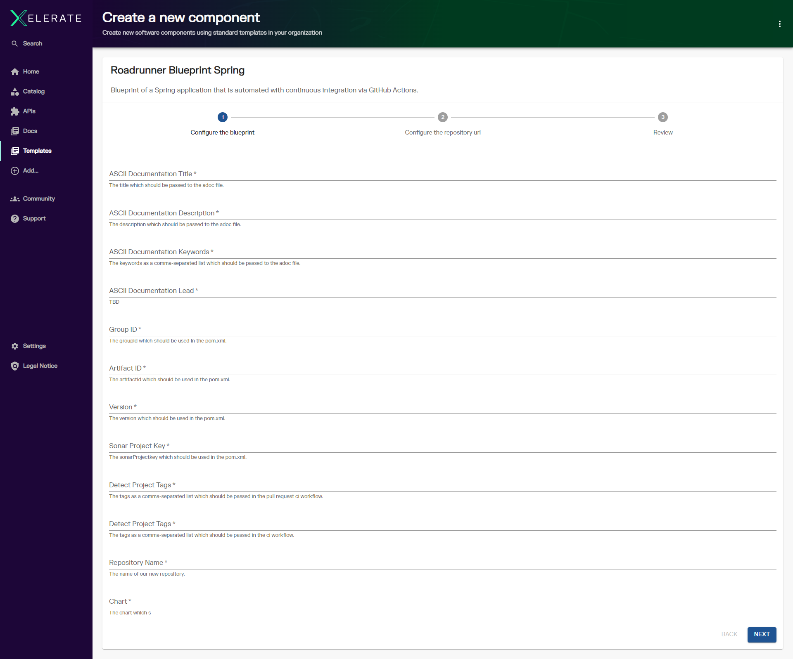
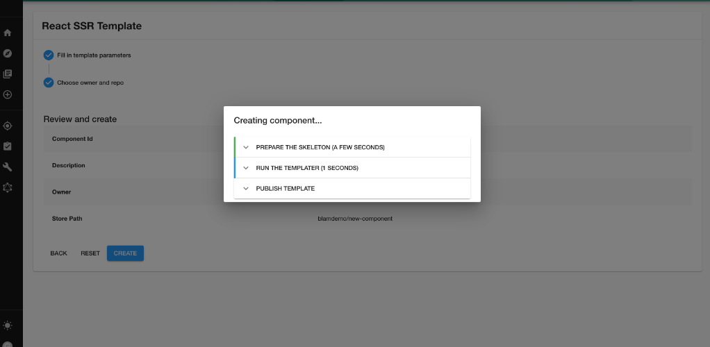
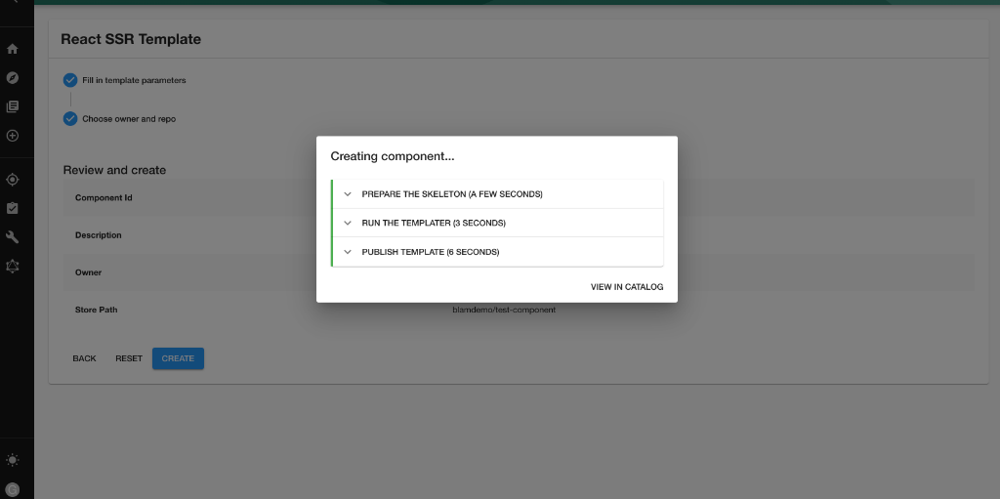
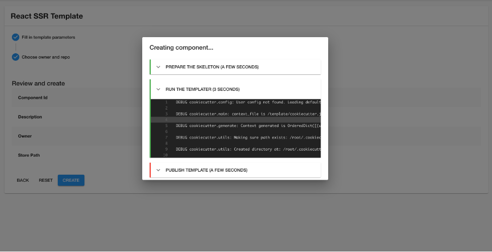
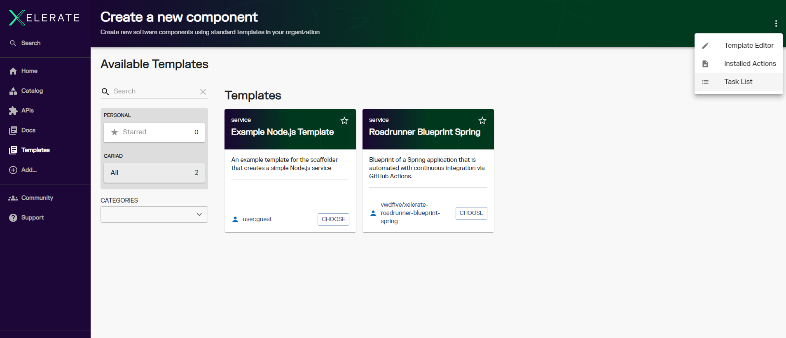
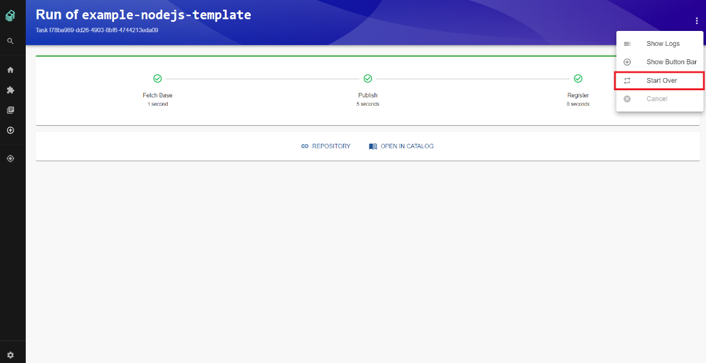

## Enable Software Templates Overview

## Introduction

Starting in mid 2024, the XELERATE team added a new set of capabilities to enable software templates in XELERATE.

The articles in this section outline the concepts, flows, processes, and provide detailed steps to implement a template.

## Overview

The Software Templates tool in XELERATE helps you create Components in Backstage. By default, it can:

- Load code skeletons
- Insert variables
- Publish templates to locations such as GitHub or GitLab

### Getting Started

The Software Templates are available under [Templates](https://cariad.developer.digital/create) in the sidebar. Once there, you should see something that looks similar to this:

## Choose a template

When you select a template that you want to make us of, you'll be taken to the next page which may or may not look different for each template. Each template can ask for different input variables, and they are then passed to the template internally.

After filling in these variables, you'll get some more fields to fill out which are required for template usage: the owner (which is a **user** in the XELERATE system), and the **storePath** which is a destination URL to create for the provider, for instance https://github.com/backstage/my-new-repository, or https://gitlab.com/myorg/myrepo.

## Run!

Once you've entered values and confirmed, you'll then get a popup box with live progress of what is currently happening with the creation of your template.

It shouldn't take too long, and you'll have a success screen!

If it fails, you'll be able to click on each section to get the log from the step that failed which can be helpful in debugging.

You can also cancel the running process. Once you clicked on button "Cancel", the abort signal will be sent to a task and all next steps won't be executed. The current step will be cancelled only if it supports it.

## View Component in Catalog

When it's been created, you'll see the `View in Catalog` button, which will take you to the registered component in the catalog:

And then you'll also be able to see it in the Catalog View table:

## Previewing and Executing Previous Template Tasks

Each execution of a template is treated as a unique task, identifiable by its own unique ID. To view a list of previously executed template tasks, navigate to the "Create" page and access the "Task List" from the context menu (represented by the vertical ellipsis, or 'kebab menu', icon in the upper right corner).

If you wish to re-run a previously executed template, navigate to the template tasks page. Locate the desired task and select the "Start Over" option from the context menu.

This action will initiate a new execution of the selected template, pre-populated with the same parameters as the previous run, but these parameters can be edited before re-execution.

In the event of a failed template execution, the "Start Over" option can be used to re-execute the template. The parameters from the original run will be pre-filled, but they can be adjusted as needed before retrying the template.
