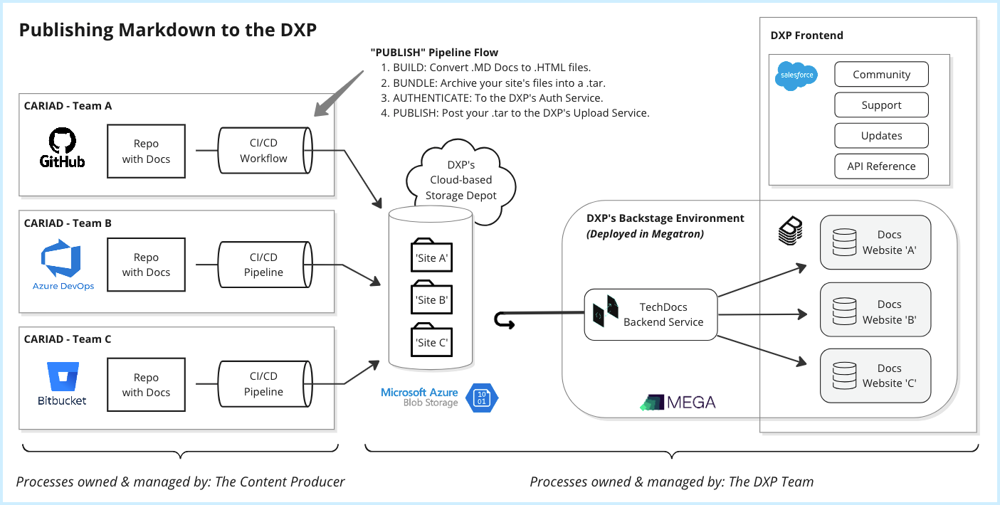
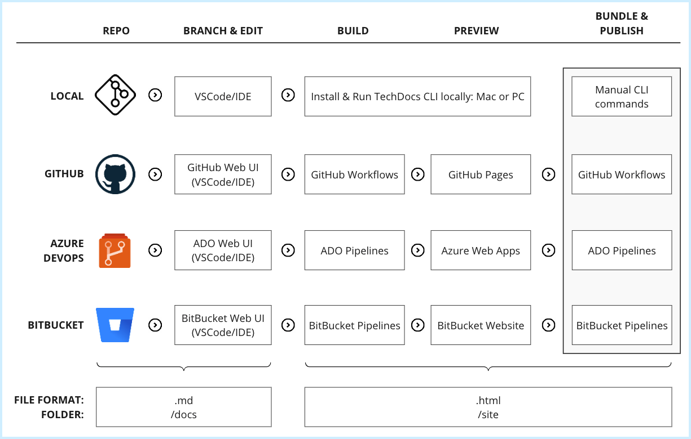

## Introduction

XELERATE allows a team to publish long-form, expository content such as Guides, Documentation, How-to articles, and tutorials and then associate that content to a Backstage entity such as a System or Component.

Backstage uses **Markdown** as it's primary file format for your source material when creating and publishing long-form content.

More specifically, Backstage uses a home-grown tool call **TechDocs** that leverages an open source Markdown standard from **MkDocs**.

At this time all expository guides and documentation you want to publish into XELERATE *must* be in MkDocs-compatible .md files, and *should* be published using the TechDocs CLI tools.

!!! abstract "References"
    - See here for more info on the [MkDocs standard](https://www.mkdocs.org/).

    - See here for more info on Backstage.io's [TechDocs](https://backstage.io/docs/features/techdocs/).

    - See here for more info on Backstage.io's [TechDocs CLI](https://backstage.io/docs/features/techdocs/concepts/#techdocs-cli).

Each entity (System, Component) can have *only one* set of Markdown Doc pages associated with it.

## Publishing Markdown Content to XELERATE

The steps to publishing your Markdown (.MD) Docs to Backstage include:

- **CREATE:** Write, edit, and review your content and then merge your changes back into a Main Branch within your own Repo.

- **BUILD:** Use tools to convert your source .MD content into .HTML content.

- **PREVIEW:** View your content as a complete website to preview your changes (optional).

- **BUNDLE:** Once reviewed and approved, bundle your completed TechDocs website content into a single `.tar` file.

- **PUBLISH:** Push your updated content to the Backstage cloud-based Storage Depot. This triggers Backstage to ingest and render your content on the Backstage production web site.

This article will introduce you to the self-publishing process for Markdown content in XELERATE, including details on the publishing flows and the Backstage components and entities involved.

## Publishing Flows

There are two "content flows", or processes, to be aware of when discussing the publishing of Markdown-based content into XELERATE: 

- The **Content Producer flow**
- The **Backstage Ingestion flow**.

### Content Producer Flow

1. Content Producers **CREATE** and edit their Docs content using Markdown-formatted files.

2. The Docs content is stored in the Content Producer's development Repo (GitHub, ADO, BitBucket, etc.)

3. Once the content is ready to be published, the Content Producer will run a CI/CD Pipeline/Workflow to:

  - Initiate a **BUILD** process, converting their Markdown files into .HTML files and storing the generated website in a new `site` folder structure.

  - **BUNDLE** the newly created website by compressing the content (page files, folder structure, config files, etc.) from their `site` folder into a single `.tar` file.

  - **PUBLISH** the `.tar` file by uploading it to a shared, secure, cloud-based Storage Depot provided by the XELERATE Admin Team.

### Backstage Ingestion Flow

1. XELERATE runs an instance of **Backstage** (deployed using Megatron's container services).

2. Backstage runs a backend service called **TechDocs** which is used to ingest, format, and display Doc content. This service is activated whenever new content is pushed to the shared storage depot.

3. Your new Docs content is retrieved from the Storage Depot, expanded, processed, and then rendered for immediate display on Backstage.

## TechDocs CLI

Once you (the Content Producer) have created your documentation content and assembled your Markdown files in a repository within your development environment, you will invoke a **BUILD** tool that processes your .MD files, collects additional metadata from YAML configuration files, converts your documents into HTML pages, and then creates a `site` folder structure that represents a complete collection of web pages for your content.

Once built, those web pages can be previewed using a local/intermediary web server and, once finalized, you can publish the `site` folder structure to Backstage's cloud-based Storage Depot.

Backstage includes a **TechDocs CLI** that should be used to BUILD and PREVIEW your content. 

You will PUBLISH your content using a simple HTTP/cURL command.

The TechDocs CLI can be deployed and used on a local machine to BUILD and PREVIEW your content repeatedly until you are satisfied with your Docs and are ready to PUBLISH. 

You can also invoke the TechDocs CLI within a CI/CD pipeline or workflow to automate these procedures. Example pipelines to do this are provided within these articles.

### TechDocs and MkDocs

Backstage's [TechDocs CLI](https://backstage.io/docs/features/techdocs/concepts#techdocs-cli) invokes the BUILD features from an open source build tool called [MkDocs](https://www.mkdocs.org/).

It may be possible to use other .MD-to-.HTML build tools, but MkDocs and the TechDocs CLI will be the focus of this documentation.

## Development Environment Flexibility

Depending on your Tech Writing team, you may decide to use any of the following methods to CREATE, BUILD, and PREVIEW your Docs content:

Setup Guides will be provided for the following development environments and methods:

1. Using a local development environment such as Visual Studio, VSCode, IntelliJ, or any other IDE you prefer:

  - [Install a local copy of the TechDocs CLI](techdocs-local.md) (and its prerequisites) on your PC or Mac to BUILD and PREVIEW Docs content using a [Docs Sample Repo](sample-docs-repo.md).

2. GitHub.com

  - [Configuring a Docs Repo in GitHub.com](publish-via-github.md) with the necessary config files and resources to BUILD, PREVIEW, BUNDLE, and PUBLISH Docs content using a [Docs Sample Repo](sample-docs-repo.md).

3. Azure DevOps

  - [Configuring a Docs Repo in ADO](publish-via-ado.md) with the necessary config files and resources to BUILD, PREVIEW and PUBLISH Docs content using a [Docs Sample Repo](sample-docs-repo.md).

4. BitBucket

  - [Configuring a Docs Repo in Bitbucket]() (COMING SOON) with the necessary config files and resources to BUILD, PREVIEW and PUBLISH Docs content using a [Docs Sample Repo](sample-docs-repo.md).

## Local Development vs. Web-based Development

Using the Web UI tools of a DevOps environment like GitHub or ADO is a quick and easy method to build and preview your .MD.-to-.HTML content. 

But in most environments, previewing your content is limited to just _one_ web instance. This may work fine for a team of one or two technical writers but can be a limitation for larger teams.

If your Documentation/Tech Writing team grows to more than a few members, it is advised that each team member install and leverage a [local instance of the TechDocs CLI tools](techdocs-local.md). This allows each team member to edit, build, and preview their .MD-to-.HTML content independent of each other.

Once all members have finished editing their individual content areas and have merged their Markdown files and images to the `main` branch, use a DevOps CI/CD pipeline/workflow to PUBLISH the finished content to the Backstage cloud-based Staging Depot for ingestion into the Backstage live environment.
