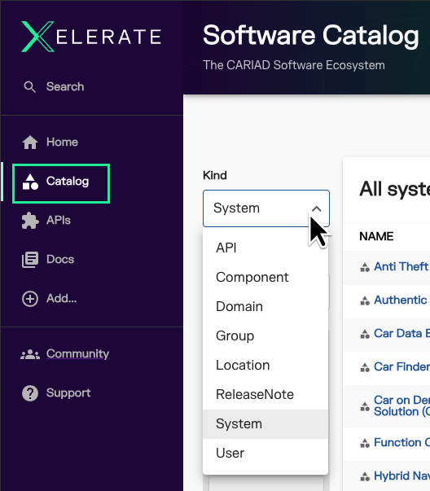

# Overview

## What is XELERATE?

XELERATE is CARIAD's implementation of the open source developer portal platform from [Backstage.io](https://backstage.io).

The heart of XELERATE is the [Software Catalog](catalog.md), an ever-growing list of CARIAD tools, services, API specifications, documentation, guides, and content; with each entry owned and maintained by the people who work on them. 

Developers across the CARIAD ecosystem (including internal teams and external partners, subsidiaries, and contractors) are able to do their jobs more effectively when software assets are easy to discover, access, and learn.

## Backstage Entities

The XELERATE Software Catalog is comprised of many unique, and often interrelated, objects called **Entities**.

You can browse the different kinds of Entities by selecting **Catalog** from the Backstage left hand side-bar menu:

Entities are defined using YAML files. 

Entities can relate to other entities in many different ways (see the [Backstage Core Entity Model](https://backstage.io/docs/features/software-catalog/system-model/)).

The most common entities published by CARIAD teams are: Systems, Components, and APIs

## TechDocs and Guides

In addition to the entities added into the catalog, a content team can also create and attach robust documentation to their entities using the MkDocs and TechDocs tools that are built-in and included with XELERATE.

The source content for your Docs and Guides (Markdown files) can be collocated alongside the code for your service or API (the classic "Docs-as-Code" model), or the Docs can be housed separately, stored in any content repository that works best for your team.

## Getting Started

In the following articles you will find details on: features, definitions, best-practices, and how-to guides, plus tips & tricks for onboarding all of your content into the XELERATE Software Catalog in order to expose your team's hard work for everyone to see, access, learn about, and share.

### Topics to explore next:

- Browse the [XELERATE]( https://developer.cariad.digital/catalog) Software Catalog of currently published tools and services.

- [Using the Software Catalog](catalog.md) to take full advantage of its content for you and your team.

- Learn about [publishing](overview.md) your content into the catalog.

- Learn how to create [Catalog Entities](entities.md) and best practices for configuring YAML files.

- Learn about Markdown, TechDocs, and publishing [Guides, Docs and expository content](./guide-publishing.md) into XELERATE.

## On Our Roadmap

Backstage has an ever-growing list of [third-party plugins](https://backstage.io/plugins/) integrating popular development tools directly into the developer portal. Internal, CARIAD-made developer tools can also be integrated by wrapping them in a plugin.

With our template library, XELERATE will enable scaffolding of new software projects that follow company standards and best practices with just a few clicks.
