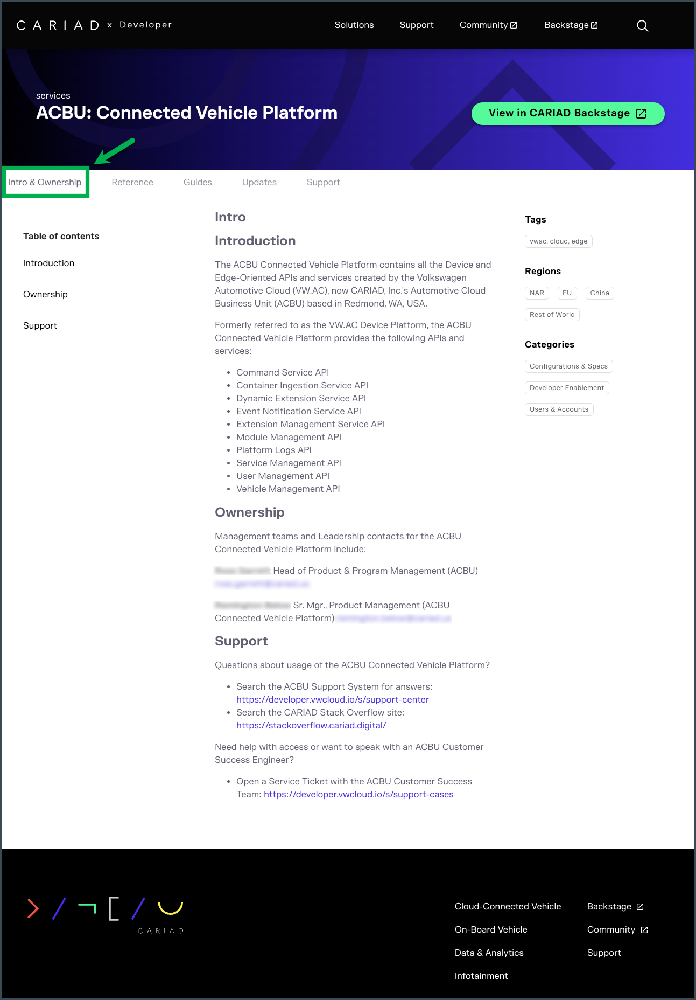

# XELERATE Front-End: Intro & Ownership Pages

!!! info "Important"
    Intro and Ownership Pages are intended for use in conjunction with the XELERATE's new Front-end.

    Intro and Ownership Pages will *not be needed nor used* unless the new XELERATE Front-end is deployed.

    Please contact the XELERATE Development team for more details on the deployment of the new XELERATE Front-end.

## Introduction Pages

In the refreshed XELERATE Front-end pages there is a new "Intro and Ownership" page for each Backstage Service.

The content displayed in the Intro and Ownership landing page comes from a special Markdown file that can be added into any service's TechDocs published Docs.

!!! info "Important"
    Only services (System or Component) that have published TechDocs/MkDocs content are able to display content on their "Intro and Ownership" page.




## Displaying Content

To display content in your "Intro and Ownership" page, you must add a file named `intro.md` to your `docs` folder alongside your other published Mardocs content.

The new `intro.md` file should be side-by-side with your `index.md` home page document.

The page's Headings (H2, H3, etc.) will be displayed as a page-level table of contents on the left-hand side of the web page.

You can place any standard MkDocs content in your Intro page, but it is required that you include at least the following content:

- Introduction
- Ownership
- Support


## Sample `intro.md` file

Below is an example Markdown file you can use as a template for your Intro content.

```
## Introduction

The ACBU Connected Vehicle Platform contains all the Device and Edge-Oriented APIs and services created by the Volkswagen Automotive Cloud (VW.AC), now CARIAD, Inc.'s Automotive Cloud Business Unit (ACBU) based in Redmond, WA, USA.

Formerly referred to as the VW.AC Device Platform, the ACBU Connected Vehicle Platform provides the following APIs and services:

- Command Service API
- Container Ingestion Service API
- Dynamic Extension Service API
- Event Notification Service API
- Extension Management Service API
- Module Management API
- Platform Logs API
- Service Management API
- User Management API
- Vehicle Management API


## Ownership

Management teams and Leadership contacts for the ACBU Connected Vehicle Platform include:

**Jane Doe**
Head of Product & Program Management (ACBU)
jane.doe@cariad.us

**John Doe**
Sr. Mgr., Product Management (ACBU Connected Vehicle Platform)
john.doe@cariad.us


## Support

Questions about usage of the ACBU Connected Vehicle Platform?

- Search the ACBU Support System for answers: https://developer.vwcloud.io/s/support-center
- Search the CARIAD Stack Overflow site: https://stackoverflow.cariad.digital/


Need help with access or want to speak with an ACBU Customer Success Engineer?

- Open a Service Ticket with the ACBU Customer Success Team: https://developer.vwcloud.io/s/support-cases
```
