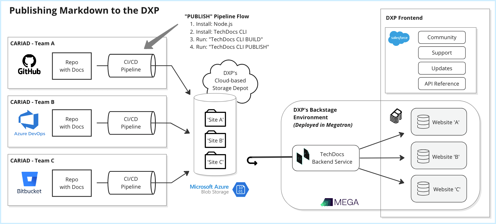
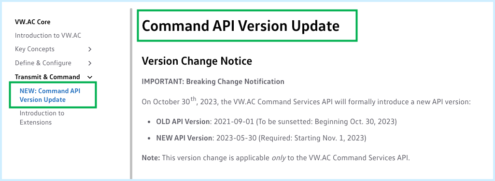
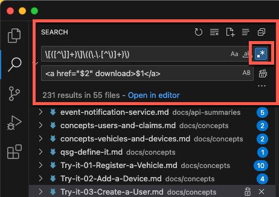
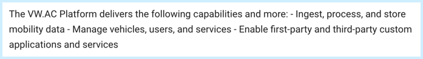
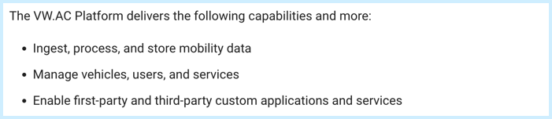
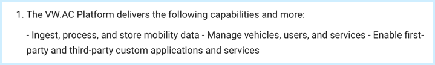
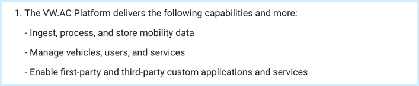
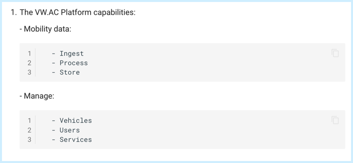

## Introduction

The self-publishing process for Markdown files has been tested and documented using out-of-the-box tools provided by [Backstage.io](https://backstage.io/docs/overview/what-is-backstage).

These tools include a **BUILD** process using [MkDocs](https://www.mkdocs.org) and a **PUBLISH** and rendering process using the [TechDocs-CLI](https://backstage.io/docs/features/techdocs/cli).

This article provides field-tested Markdown-based **Tips and Techniques** that have helped other XELERATE content creators to overcome challenges and to create better-looking content with fewer road blocks.

### Have a new tip to contribute?

Please reach out to the Backstage Admin Team to share your feedback and suggestions!


## Markdown Flavors and Extensions

There are a lot of Markdown flavors out there and different versions can impact (improve or detract) the display of your HTML output as well as your end-user experience. 

The core, Backstage-provided **BUILD** tool from MkDocs uses [Python-Markdown](https://python-markdown.github.io) as its library to convert `.md` files to `.html` files.

MkDocs, as a standalone product, includes support for [extending](https://www.mkdocs.org/user-guide/configuration/#markdown_extensions) its Markdown features through [Python-Markdown extensions](https://python-markdown.github.io/extensions). Additional MkDocs extensions such as [mkdocs-macros](https://mkdocs-macros-plugin.readthedocs.io/en/latest) are available as well.

A full list of MkDocs Plug-ins can be found here: https://github.com/mkdocs/mkdocs/wiki/MkDocs-Plugins

To date _none_ of these plug-ins or extensions have been tested.

Please give them a try! 

If you get them to work, please share your experience with the XELERATE Team. We will document your efforts here for other teams to benefit from.

### Alternate Markdown Support

At this time, the out-of-the-box **TechDocs-CLI** and **MkDocs** tools are used and referred to throughout the XELERATE documentation.

MkDocs's [reference implementation](https://daringfireball.net/projects/markdown/) for Markdown is from the [Daring Fireball Company](https://daringfireball.net/projects/markdown/).

Other [Markdown variants](https://en.wikipedia.org/wiki/Markdown#Variants) and [Markdown flavors](https://en.wikipedia.org/wiki/Lightweight_markup_language#Comparison_of_language_features) on the market include:

- [AsciiDoc](https://asciidoc.org/)

- [CommonMark](https://commonmark.org)

- [GitHub Flavored Markdown (GFM)](https://github.github.com/gfm)

- [Markdown Extra](https://michelf.ca/projects/php-markdown/extra)

To date _none_ of these variants have been tested.

Please give them a try! 

If you get one to work, please share your experience with the XELERATE Team. We will document your efforts here for other teams to benefit from.


## MkDocs: Tips and Techniques

1. **Linking to other `.md` pages**

  Reference: https://www.mkdocs.org/user-guide/writing-your-docs/#writing-with-markdown

  The MkDocs format for linking to another `.md` page in your Docs Repo  that resides in a _different_ folder is as follows:
  
  **Note:** Use relative references (including ellipses) pointing to the referenced `.md` file's location.  

  Example:
  ```
  See the related article [Configure SPN Settings](../../data-products/dp02.SPN-settings.md) for further details.
  ```

  The MkDocs format for linking to another `.md`page in your Docs Repo that resides in the _same_ folder is as follows:
  
  **Note:** No ellipses needed.
  
  Example:
  ```
  See [Configuring a Docs Repo in GitHub](publish-via-github.md).
  ```

  The MkDocs **BUILD** process will adjust file names, file extensions, and file locations as needed when it builds your `/site` structure based on your Table of Contents.

2. **Formatting for image references**

  The MkDocs format for displaying images is:

  Example:
  ```
  
  ```

  Include your "Alternate Text" in [square brackets] followed by the relative link to the graphic in (parentheses).

3. **Home page as `index.md`**

  Our [current documentation](techdocs-local.md/#home-page-via-indexmd) specifies that your website's home page _must_ be named `index.md` and _must_ be located in the root of your Docs folder.

  Renaming and relocating your home page may be possible.

  See the articles on [Configure Index Pages and Navigation](https://www.mkdocs.org/user-guide/writing-your-docs/#index-pages) and the [use of the `nav: homepage:`](https://www.mkdocs.org/dev-guide/themes/#mkdocs.structure.nav.Navigation.homepage) object.

  Please try it! 

  If you get this to work, please share your experience with the XELERATE Team. We will document your efforts here for other teams to benefit from.

4. **H1 and Page Titles**

  Each page will have a Page Title that will be displayed at the top of the document.

  If your Markdown file has an H1 entry (for example: "**# Command API Version Update**") it will be displayed as the Page Title.

  If your Markdown down does *not* have an H1 entry, the Title from the `mkdocs.yml` will be used.

  Example:

  ```{.yaml linenums="1"}
  nav:
    - Introduction to ACBU: index.md
    - Key Concepts:
    - Define & Configure:
    - Transmit & Command:
      - "NEW: Command API Version Update": extensions/cmd-api-update.md
      - Introduction to Extensions: extensions/intro.md
  ```

  **Note:** The title "NEW: Command API Version Update" needs to be enclosed in quotes because of the colon (:) used in the title.

  This allows you to use one title used in the Table of Contents and a *different* title for the top of the page:

  
   

## Downloadable Files

You can add files (.zip, .pdf, etc.) into your Docs repo that are intended to be downloaded by your users.

The challenge is finding the correct markup notation to get the desired results. 

### Markup notation for download links

Standard .MD annotation for marking files for download does not seem to carry through the BUILD and PUBLISH process.

We needed to convert our markup notation for downloadable files into HTML marking to be successful.

Through trial and testing we have discovered the following:

**Testing Results:**

| Result      | Markup Notation | Comments |
|-------------|-----------------|----------|
| Failure     | `[vwac-vv CLI .zip file](../files/vwac_vv_v1.zip)` | Does not produce a usable link. 
| Failure     | `[vwac-vv CLI .zip file](../files/vwac_vv_v1.zip){: download}` | Download dialog pops up as desired but the filename is always "download".
| **Success** | `<a href="../files/vwac_vv_v1.zip" download>vwac-vv CLI .zip file</a>` | Download dialog pops up with correct filename.

The .HTML markings are successfully retained throughout the TechDocs publishing process and will result in a fully-functional file download link.

### Search and Replace Tips

If you have existing Doc pages that reference downloadable files using .MD notations, you can use a Regular Expression-based search and replace technique to find the .MD marks and change them to .HTML marks.

!!! tip "Important"
    This Search and Replace concept should ONLY be applied to file links that you want to present as **Click to Download** links. This technique should NOT be used for images that you simply want to display in-line.

Steps to find and replace .MD notation with .HTML notation in VSCode:

1.	Run VSCode and open you file(s)/repo.
2.	Press "CTRL+SHIFT+F" (PC) or "CMD+SHIFT+F" (Mac) to open the "Search" bar.
3.	Click the `>` chevron to expand and display the "Replace" text box.
4.	Click the `.*` entry (to the far right of the "Search" text box) to enable "RegEx".
5.	In the Search box, enter: `\[([^\]]+)\]\((\.\.[^\)]+)\)`
6.	In the Replace box, enter: `<a href="$2" download>$1</a>`



**Note:** Adapt the RegEx as needed for your specific environment. 

**Credit:** ChatGPT for the above RegEx solution.

**Reference:** https://github.com/backstage/backstage/issues/13940


## Nested lists

MkDocs seems to suffer from poor rendering of lists -- especially nested lists.

Issues reported include:

- Poor spacing between line items
- Inconsistent bullets (dashes vs. solid bullets vs.open bullets)
- Condensing of lists into one paragraph instead of a normal unordered list
- Rendering list items as code blocks

Online discussion forums point to multiple add-ons that might assist in rectifying the display issues, often concluding with: https://github.com/radude/mdx_truly_sane_lists
    
At the moment, the XELERATE Team is focused on standing up the self-publishing services for Markdown and Swagger content and will revisit the refinement of `.md` appearance in the near future.

In the meantime, here are some tips:

1. Insert a carriage return between the your heading and the start of your list

  For example, the following Markdown content is valid and will preview properly in many editing tools (such as VSCode). But it will _not_ display correctly when using MkDocs/TechDocs-CLI to **BUILD** your web page:

  ```
  The ACBU Platform delivers the following capabilities and more:
  - Ingest, process, and store mobility data
  - Manage vehicles, users, and services
  - Enable first-party and third-party custom applications and services
  ```

  The above Markdown as rendered by MkDocs/TechDocs-CLI:

  

  The same content, modified with an added carriage return, now displays correctly:

  ```
  The ACBU Platform delivers the following capabilities and more:

  - Ingest, process, and store mobility data
  - Manage vehicles, users, and services
  - Enable first-party and third-party custom applications and services
  ```

  The above Markdown as rendered by MkDocs/TechDocs-CLI:

  

2. Nested lists

  It may be necessary to insert a `<CR>` between list items in a nested list.

  For example:

  ```
  1. The ACBU Platform delivers the following capabilities and more:

    - Ingest, process, and store mobility data
    - Manage vehicles, users, and services
    - Enable first-party and third-party custom applications and services
  ```

  The above Markdown as rendered by MkDocs/TechDocs-CLI:

  

  The same content, modified with added carriage returns, now displays correctly:

  ```
  1. The ACBU Platform delivers the following capabilities and more:

    - Ingest, process, and store mobility data

    - Manage vehicles, users, and services

    - Enable first-party and third-party custom applications and services
  ```

  The above Markdown as rendered by MkDocs/TechDocs-CLI:

  

3. Three-level nested lists

  An unordered list (bullets) within an ordered (numbered) list displays poorly if your "nest" reaches the third level.

  For example:

  ```
  1. The ACBU Platform capabilities:

    - Mobility data:
    
      - Ingest
      - Process
      - Store
    
    - Manage: 
        
      - Vehicles
      - Users
      - Services
  ```

  The above Markdown as rendered by MkDocs/TechDocs-CLI:

  

  No work-around is known at this time. Rework your content to avoid three-level nested lists.


## TechDocs CLI: Tips and Techniques

1. Using TechDocs CLI to BUILD

  When using the TechDocs CLI tool to **BUILD**, it invokes the MkDocs tool, within a Docker container, to conduct the actual building process. Therefore, Docker Desktop must be installed locally if running on a local computer. 
  
  If you are running this command in a CI/CD pipeline or workflow, your CI/CD environment must allow your VM or container to _launch_ another container as a Docker container. If Docker is not supported or if launching another container from within a pipeline/workflow is not supported you may be able to use the MkDocs Build tools instead.

  If needed, consider installing the native MkDocs tools in addition to the TechDocs CLI tools. MkDocs has its own [CLI tool](https://www.mkdocs.org/user-guide/cli/) that can be used to **BUILD** and **PREVIEW** Docs content.

  You can invoke the installed MkDocs's BUILD process when using the TechDocs CLI BUILD command by specifying the `--no-docker` parameter. This will cause the TechDocs CLI to launch the `MkDocs BUILD` server locally (or within a pipeline) to complete the build process rather than launching a Docker container.

2. Using MkDocs CLI to BUILD

  Although XELERATE's current documentation focuses solely on the out-of-the-box TechDocs CLI tools, in theory, rendering `.md` files into `.html` files can be done using any conversion tool of your choosing. 

  If you get another conversion/rendering tool to work (such as the [MkDocs CLI's **BUILD**](https://www.mkdocs.org/user-guide/cli/) tool), please share your experience with the XELERATE Team. We will document your efforts here for other teams to benefit from.
