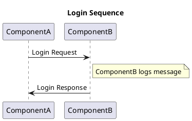

# Markdown Extensions: Usage Examples

See below for sample usage and example syntax for many of the built-in Markdown extensions available for you to use on XELERATE.

!!! note
    You are strongly advised to test the rendering of each one of these to ensure it displays to your liking.


## Admonitions (Callout Boxes)

See the [Material for MkDocs](https://squidfunk.github.io/mkdocs-material/reference/admonitions/) site for complete details.

### Basic usage

Precede your callout box content with three exclamation points (`!!!`) followed by a box style name (e.g.: `note`). 

Indent each paragraph of content by four spaces, like below:

```
!!! note
    Lorem ipsum dolor sit amet, consectetur adipiscing elit. Nulla et euismod nulla. Curabitur feugiat, tortor non consequat finibus, justo purus auctor massa, nec semper lorem quam in massa.
```

Result: 

!!! note
    Lorem ipsum dolor sit amet, consectetur adipiscing elit. Nulla et euismod
    nulla. Curabitur feugiat, tortor non consequat finibus, justo purus auctor
    massa, nec semper lorem quam in massa.

### Customize the title

Add your custom title in "double quotes" after the box's style name:

```
!!! note "This is my custom title"
    Lorem ipsum dolor sit amet, consectetur adipiscing elit. Nulla et euismod
    nulla. Curabitur feugiat, tortor non consequat finibus, justo purus auctor
    massa, nec semper lorem quam in massa.
```

Result: 

!!! note "This is my custom title"
    Lorem ipsum dolor sit amet, consectetur adipiscing elit. Nulla et euismod
    nulla. Curabitur feugiat, tortor non consequat finibus, justo purus auctor
    massa, nec semper lorem quam in massa.

### Box options: Styles and Icons

Change the keyword after the `!!!` to select from twelve default styles, colors, and icons.

```
!!! note
!!! abstract
!!! info
!!! tip
!!! question
!!! success
!!! failure
!!! warning
!!! danger
!!! bug
!!! example
!!! quote
```

Results:

!!! note
    Lorem ipsum dolor sit amet, consectetur adipiscing elit. Nulla et euismod
    nulla. Curabitur feugiat, tortor non consequat finibus, justo purus auctor
    massa, nec semper lorem quam in massa.

!!! abstract
    Lorem ipsum dolor sit amet, consectetur adipiscing elit. Nulla et euismod
    nulla. Curabitur feugiat, tortor non consequat finibus, justo purus auctor
    massa, nec semper lorem quam in massa.

!!! info
    Lorem ipsum dolor sit amet, consectetur adipiscing elit. Nulla et euismod
    nulla. Curabitur feugiat, tortor non consequat finibus, justo purus auctor
    massa, nec semper lorem quam in massa.

!!! tip
    Lorem ipsum dolor sit amet, consectetur adipiscing elit. Nulla et euismod
    nulla. Curabitur feugiat, tortor non consequat finibus, justo purus auctor
    massa, nec semper lorem quam in massa.

!!! question
    Lorem ipsum dolor sit amet, consectetur adipiscing elit. Nulla et euismod
    nulla. Curabitur feugiat, tortor non consequat finibus, justo purus auctor
    massa, nec semper lorem quam in massa.

!!! success
    Lorem ipsum dolor sit amet, consectetur adipiscing elit. Nulla et euismod
    nulla. Curabitur feugiat, tortor non consequat finibus, justo purus auctor
    massa, nec semper lorem quam in massa.

!!! failure
    Lorem ipsum dolor sit amet, consectetur adipiscing elit. Nulla et euismod
    nulla. Curabitur feugiat, tortor non consequat finibus, justo purus auctor
    massa, nec semper lorem quam in massa.

!!! warning
    Lorem ipsum dolor sit amet, consectetur adipiscing elit. Nulla et euismod
    nulla. Curabitur feugiat, tortor non consequat finibus, justo purus auctor
    massa, nec semper lorem quam in massa.

!!! danger
    Lorem ipsum dolor sit amet, consectetur adipiscing elit. Nulla et euismod
    nulla. Curabitur feugiat, tortor non consequat finibus, justo purus auctor
    massa, nec semper lorem quam in massa.

!!! bug
    Lorem ipsum dolor sit amet, consectetur adipiscing elit. Nulla et euismod
    nulla. Curabitur feugiat, tortor non consequat finibus, justo purus auctor
    massa, nec semper lorem quam in massa.

!!! example
    Lorem ipsum dolor sit amet, consectetur adipiscing elit. Nulla et euismod
    nulla. Curabitur feugiat, tortor non consequat finibus, justo purus auctor
    massa, nec semper lorem quam in massa.

!!! quote
    Lorem ipsum dolor sit amet, consectetur adipiscing elit. Nulla et euismod
    nulla. Curabitur feugiat, tortor non consequat finibus, justo purus auctor
    massa, nec semper lorem quam in massa.

### Remove the title

You can remove the "Title Box" entirely by entering an empty title:

```
!!! success ""
    The box retains the outline color from the selected style.
    This box is green.

!!! failure ""
    The box retains the outline color from the selected style.
    This box is red.
```

Result: 

!!! success ""
    The box retains the outline color from the selected style.
    This box is green.

!!! failure ""
    The box retains the outline color from the selected style.
    This box is red.

### Collapsible boxes

Start the callout box with `???` instead of `!!!`.

Add a `+` after the `???+` to display the block "expanded" by default.

Example:

```
??? note "Collapsed by default using `???`"
    Lorem ipsum dolor sit amet, consectetur adipiscing elit. Nulla et euismod
    nulla. Curabitur feugiat, tortor non consequat finibus, justo purus auctor
    massa, nec semper lorem quam in massa.

???+ note "Expanded by default using `???+`"
    Lorem ipsum dolor sit amet, consectetur adipiscing elit. Nulla et euismod
    nulla. Curabitur feugiat, tortor non consequat finibus, justo purus auctor
    massa, nec semper lorem quam in massa.
```

Results:

??? note "Collapsed by default using `???`"
    Lorem ipsum dolor sit amet, consectetur adipiscing elit. Nulla et euismod
    nulla. Curabitur feugiat, tortor non consequat finibus, justo purus auctor
    massa, nec semper lorem quam in massa.

???+ note "Expanded by default using `???+`"
    Lorem ipsum dolor sit amet, consectetur adipiscing elit. Nulla et euismod
    nulla. Curabitur feugiat, tortor non consequat finibus, justo purus auctor
    massa, nec semper lorem quam in massa.

### Nested boxes

Indent as needed to nest callout boxes.

Example:

`````
```
???+ abstract "Steps to follow"
    Be sure to follow the steps below carefully.

    ??? danger "Or bad things can happen!!"
        Although it you can simply click undo and return to safety. Phew!
```
`````

Results: 

???+ abstract "Steps to follow"
    Be sure to follow the steps below carefully.

    ??? danger "Or bad things can happen!!"
        Although it you can simply click undo and return to safety. Phew!

### Inline blocks / Sidebars

Admonitions can be rendered as inline blocks (aka, sidebars).

Inline blocks must be declared *prior* to the content block you want to place them beside. 

*Be careful: The vertical spacing of the sidebar can extend farther that you expect! Use with caution!*

Example - Left sidebar, add the `inline` modifier:

!!! info inline "Left Sidebar"
    Lorem ipsum dolor sit amet, consectetur
    adipiscing elit...

```
!!! info inline "Left Sidebar"
    Lorem ipsum dolor sit amet, consectetur
    adipiscing elit. Nulla et euismod nulla.
    Curabitur feugiat, tortor non consequat
    finibus, justo purus auctor massa, nec
    semper lorem quam in massa.
```

Example - Right sidebar, add the `inline end` modifier:

!!! info inline end "Right Sidebar"
    Lorem ipsum dolor sit amet, consectetur
    adipiscing elit...

```
!!! info inline end "Right Sidebar"
    Lorem ipsum dolor sit amet, consectetur
    adipiscing elit. Nulla et euismod nulla.
    Curabitur feugiat, tortor non consequat
    finibus, justo purus auctor massa, nec
    semper lorem quam in massa.
```


## PlantUML Diagrams

Use this extension to specify a PlantUML diagram in plain-text that will be converted into an image and inserted into the document.

See [plantuml-markdown](https://pypi.org/project/plantuml-markdown/) for more information on supported formats and configuration specifics.

Example 1:

`````
```plantuml
  Goofy ->  MickeyMouse: calls
  Goofy <-- MickeyMouse: responds
```
`````

Result 1: 

```plantuml
  Goofy ->  MickeyMouse: calls
  Goofy <-- MickeyMouse: responds
```

Example 2:

`````

`````

Result 2: 


## PyMdown Examples

There are several built-in Python Markdown (PyMdown) Extensions that provide interesting and beneficial features.

Many of the more beneficial ones are explained below.

### Caret

Reference: https://facelessuser.github.io/pymdown-extensions/extensions/caret/

Caret adds two different features which use the `^` character. 

**Insert:** Enclose text with double carets `^^...^^` to ^^underline^^ the text that is to be considered as "added/inserted text".

Example:

```
Be sure to add your ^^globally unique^^ ID into the code snippet.
```

Result: 

Be sure to add your ^^globally unique^^ ID into the code snippet.

**Superscript:** To denote a superscript, surround the desired content in single carats `^...^`.

Example:

```
H^2^0

Text^with\ a\ superscript^
```

Results: 

H^2^0

Text^with\ a\ superscript^

### Tilde

Reference: https://facelessuser.github.io/pymdown-extensions/extensions/tilde/

Like Caret, Tilde adds two features which use the `~` character.

**Delete:** Enclose text with double tildes `~~...~~` to ~~strikeout~~ text that is to be considered "deleted text".

Example:

```
Department of Redundancy ~~Department~~
```

Result:

Department of Redundancy ~~Department~~

**Subscript:** To denote a subscript, surround the desired content in single tildes: `~...~`.

Example:

```
CH~3~CH~2~OH

Text~with\ a\ subscript~
```

Results:

CH~3~CH~2~OH

Text~with\ a\ subscript~

### Emoji

Reference: https://facelessuser.github.io/pymdown-extensions/extensions/emoji/

The Emoji extension adds support for inserting emojis via simple short names enclosed within colons, e.g. `:short_name:`. 

This requires the use of a **short name index** to map easy-to-remember names to their associated Unicode data equivalent. 

The Unicode data is then converted into actual Unicode emoji characters and/or special HTML elements (usually images) that represent the emoji by using an **emoji generator**.

Example 1:

```
:smile: :heart: :thumbsup:
```

Result 1:

:smile: :heart: :thumbsup:

Example 2:

```
| **Language** | **Logging**        | **Storage**        | **Vehicle Connector**    | **Cloud Connector**          |
|--------------|--------------------|--------------------|--------------------------|------------------------------|
| **C#**       | :heavy_check_mark: | :heavy_check_mark: | :ballot_box_with_check:  | :heavy_check_mark: <br> gRPC |
| **node.js**  | :heavy_check_mark: | :heavy_check_mark: | :x: <br> not planned     | :heavy_check_mark: <br> gRPC |
```

Result2:

| **Language** | **Logging**        | **Storage**        | **Vehicle Connector**    | **Cloud Connector**          |
|--------------|--------------------|--------------------|--------------------------|------------------------------|
| **C#**       | :heavy_check_mark: | :heavy_check_mark: | :ballot_box_with_check:  | :heavy_check_mark: <br> gRPC |
| **node.js**  | :heavy_check_mark: | :heavy_check_mark: | :x: <br> not planned     | :heavy_check_mark: <br> gRPC |

### SuperFences

Reference: https://facelessuser.github.io/pymdown-extensions/extensions/superfences/

With SuperFences, you can control the display of code fences that are nested inside other syntaxes and objects.

For example, a fenced code-block enclosed in triple backticks ( ``` ) would not normally be able to be nested inside a bulleted list.

Example:

`````
- ```
  A fenced code-block
  with two lines
  ```
`````

Result: 

- ```
  A fenced code-block
  with two lines
  ```

By adding the ASCII code marker for the space character (`&#32;`), SuperFences improves the display of the nested code fence.

Example:

`````
- &#32;
  ```
  A fenced code-block
  with two lines
  ```
`````

Result: 

- &#32;
  ```{linenums="1"}
  A fenced code-block
  with two lines
  ```

### Highlight

Reference: https://facelessuser.github.io/pymdown-extensions/extensions/highlight/

Highlight gives you better control over the display of line numbers in code fences, as well as the ability to add highlight colors in code fences.

**Code highlighting (coloring):**

By adding a programming language name after the triple backticks ( ``` ) of a fenced code-block, the Highlight extension will properly color-mark your code

Example:

`````
```{.json linenums="1"}
{
    "VehicleUuid": "0123456789ABCDEFG",
    "VehicleOrgLevel1": ["VWAG"],
    "VehicleOrgLevel2": ["A"],
    "VehicleOrgLevel3": ["DE"],
    "AdditionalProperties": {"VehicleColor": "Tango Red Metallic"}
}
```
`````

Result: 

```{.json linenums="1"}
{
    "VehicleUuid": "0123456789ABCDEFG",
    "VehicleOrgLevel1": ["VWAG"],
    "VehicleOrgLevel2": ["A"],
    "VehicleOrgLevel3": ["DE"],
    "AdditionalProperties": {"VehicleColor": "Tango Red Metallic"}
}
```

Supported code descriptions include: `ruby`, `java`, `cs` for c#, `cpp` for c++, `json`, `html`, etc.


**Code line numbering:**

By default, line numbering in code fences is enabled **globally** by default. 

This may be desireable for code snippets, but might detract from other, text-only content.

Example:

`````
```
$ chmod +x vwac-vv

$ ls -l vwac-vv
-rwxr-xr-x@ 1 user  staff  101653328 Jul 27 13:59 vwac-vv
```
`````

Result:

```{linenums="1"}
$ chmod +x vwac-vv

$ ls -l vwac-vv
-rwxr-xr-x@ 1 user  staff  101653328 Jul 27 13:59 vwac-vv
```

By **globally disabling** default line numbering, you can then **re-enable** line numbering *only* on the fenced code-blocks where you want it.

To disable global line numbering you must edit your `mkdocs.yml` file. This file is commonly found in the root of your documentation folder (as described in the [Sample Docs Repo](sample-docs-repo.md) article).

Add `linenums: none` under `- pymdownx.highlight:` below the `markdown_extensions:` section in your `mkdocs.yml` file:

Example:

```yaml
markdown_extensions:
  - pymdownx.highlight:
      linenums: none
```

Once global line numbering has been disabled, you can now add line numbering *back* into those code-blocks where you want it to show.

Do this by adding `{linenums="1"}` after the triple backticks of a code-block.

Example:

`````
```{linenums="1"}
{
    "VehicleUuid": "0123456789ABCDEFG",
    "VehicleOrgLevel1": ["VWAG"],
    "VehicleOrgLevel2": ["A"],
    "VehicleOrgLevel3": ["DE"],
    "AdditionalProperties": {"VehicleColor": "Tango Red Metallic"}
}
```
`````

Result: 

```{linenums="1"}
{
    "VehicleUuid": "0123456789ABCDEFG",
    "VehicleOrgLevel1": ["VWAG"],
    "VehicleOrgLevel2": ["A"],
    "VehicleOrgLevel3": ["DE"],
    "AdditionalProperties": {"VehicleColor": "Tango Red Metallic"}
}
```

To include a coding language name (for proper color highlighting) *as well* as enabling line numbers, use the syntax: `{.code-language linenums="1"}`.

Example:

`````
```{.json linenums="1"}
{
    "VehicleUuid": "0123456789ABCDEFG",
    "VehicleOrgLevel1": ["VWAG"],
    "VehicleOrgLevel2": ["A"],
    "VehicleOrgLevel3": ["DE"],
    "AdditionalProperties": {"VehicleColor": "Tango Red Metallic"}
}
```
`````

Result: 

```{.json linenums="1"}
{
    "VehicleUuid": "0123456789ABCDEFG",
    "VehicleOrgLevel1": ["VWAG"],
    "VehicleOrgLevel2": ["A"],
    "VehicleOrgLevel3": ["DE"],
    "AdditionalProperties": {"VehicleColor": "Tango Red Metallic"}
}
```

**Code start number:**

You can also change the **start number** of your line numbering.

Example:

`````
```{.json linenums="101"}
    "colors": {
        "FINISH": {
            "code": "0E"
        },
        "INTERIOR": {
            "code": "FW"
        },
        "TOP": {
            "code": "0E"
        },
        "PAINT": {
            "code": "LY9T"
        }
    }
```
`````

Result: 

```{.json linenums="101"}
    "colors": {
        "FINISH": {
            "code": "0E"
        },
        "INTERIOR": {
            "code": "FW"
        },
        "TOP": {
            "code": "0E"
        },
        "PAINT": {
            "code": "LY9T"
        }
    }
```

**Code line highlighting:**

You can add ==highlights== to individual lines within a code-block for added emphasis using the `hl_lines="x y z"` setting. 

The example below highlights lines 5 & 6 to emphasize the "Interior Code" section.

Example:

`````
```{.json linenums="1" hl_lines="5 6"}
    "colors": {
        "FINISH": {
            "code": "0E"
        },
        "INTERIOR": {
            "code": "FW"
        },
        "TOP": {
            "code": "0E"
        },
        "PAINT": {
            "code": "LY9T"
        }
    }
```
`````

Result:

```{.json linenums="1" hl_lines="5 6"}
    "colors": {
        "FINISH": {
            "code": "0E"
        },
        "INTERIOR": {
            "code": "FW"
        },
        "TOP": {
            "code": "0E"
        },
        "PAINT": {
            "code": "LY9T"
        }
    }
```

If you combine `linenums` and `hl_lines`, be aware that `hl_lines` always counts lines starting at 1, regardless of the value set for `linenums`:

`````
```{.json linenums="101" hl_lines="5 6"}
    "colors": {
        "FINISH": {
            "code": "0E"
        },
        "INTERIOR": {
            "code": "FW"
        },
        "TOP": {
            "code": "0E"
        },
        "PAINT": {
            "code": "LY9T"
        }
    }
```
`````

Result:

```{.json linenums="101" hl_lines="5 6"}
    "colors": {
        "FINISH": {
            "code": "0E"
        },
        "INTERIOR": {
            "code": "FW"
        },
        "TOP": {
            "code": "0E"
        },
        "PAINT": {
            "code": "LY9T"
        }
    }
```

### InlineHilite

Reference: https://facelessuser.github.io/pymdown-extensions/extensions/inlinehilite/

InlineHilite uses `:::` (three colons) or `#!` to add color markings to **in-line** code similar to the color markings that Highlight (above) adds to fenced code-blocks.

The examples below illustrate adding HTML coloring to in-line code:

```
Add a **Go to Top** link using this HTML code: `<a href="#top">Go to Top</a>` (no color)

Add a **Go to Top** link using this HTML code: `#!html <a href="#top">Go to Top</a>` (a slight green hue is applied)
```

Results: 

Add a **Go to Top** link using this HTML code: `<a href="#top">Go to Top</a>` (no color)

Add a **Go to Top** link using this HTML code: `#!html <a href="#top">Go to Top</a>` (a slight green hue is applied)

### Mark

Reference: https://facelessuser.github.io/pymdown-extensions/extensions/mark/

Add a simple (and non-configurable) highlight color to any text in your Mardown pages by surrounding the content with double equal signs: `==text here==`. 

This adds the HTML `<mark></mark>` tags to your content.

Example:

```
Important: This feature will be ==deprecated on December, 31==.
```

Result: 

Important: This feature will be ==deprecated on December, 31==.

### SmartSymbols

Reference: https://facelessuser.github.io/pymdown-extensions/extensions/smartsymbols/

SmartSymbols adds syntax for creating special characters such as trademarks, arrows, fractions, etc. 

Supported transformations include:

| Markdown           | Result |
|--------------------|--------|
| `(tm)`             | (tm)
| `(c)`              | (c)
| `(r)`              | (r)
| `c/o`              | c/o
| `+/-`              | +/-
| `-->`              | -->
| `<--`              | <--
| `<-->`             | <-->
| `=/=`              | =/=
| `1/4`, `1/4`, etc. | 1/4, 1/2, etc.
| `1st`, `2nd`, etc. | 1st, 2nd, etc.

### Tabbed

Reference: https://facelessuser.github.io/pymdown-extensions/extensions/tabbed/

The Tabbed extension uses triple equal signs (`===`) to create a multi-tabbed user interface.

Start with `===` to indicate your first tab, followed by a "quoted title". 

Multiple tabs are grouped together into a tab set.

Example: 

```
=== "Tab 1"
    Markdown **content**.

    Multiple paragraphs.

=== "Tab 2"
    More Markdown **content**.

    - list item a
    - list item b
```

Result: 

=== "Tab 1"
    Markdown **content**.

    Multiple paragraphs.

=== "Tab 2"
    More Markdown **content**.

    - list item a
    - list item b

### TaskList

Reference: https://facelessuser.github.io/pymdown-extensions/extensions/tasklist/

The Tasklist extension adds support for styled checkbox lists, showing steps to be done. 

The lists in Tasklist are crafted just like regular bulleted lists, but prefixed with `[ ]` for empty or `[x]` for filled checkboxes.

**Note:** The boxes (whether checked or unchecked) are not clickable/changeable and are for static display only.

Example: 

```
- [x] Lorem ipsum dolor sit amet, consectetur adipiscing elit
- [x] Nulla lobortis egestas semper
- [ ] Vestibulum convallis sit amet nisi a tincidunt
  - [x] In hac habitasse platea dictumst
  - [x] Sed egestas felis quis elit dapibus, ac aliquet turpis mattis
  - [ ] Praesent sed risus massa
- [ ] Nulla vel eros venenatis, imperdiet enim id, faucibus nisi
```

Result:

- [x] Lorem ipsum dolor sit amet, consectetur adipiscing elit
- [x] Nulla lobortis egestas semper
- [ ] Vestibulum convallis sit amet nisi a tincidunt
  - [x] In hac habitasse platea dictumst
  - [x] Sed egestas felis quis elit dapibus, ac aliquet turpis mattis
  - [ ] Praesent sed risus massa
- [ ] Nulla vel eros venenatis, imperdiet enim id, faucibus nisi

### Buttons and Tooltips

Reference: https://squidfunk.github.io/mkdocs-material/setup/extensions/python-markdown/#attribute-lists

The Attribute Lists extension can be leveraged to create buttons and add simple tooltips.

**Adding buttons:**

Reference: https://squidfunk.github.io/mkdocs-material/reference/buttons/#adding-buttons

To render a link as a button, suffix it with curly braces and add the `.md-button` CSS class selector to it. 

```
[Example of a Button](#){ .md-button }
```

[Example of a Button](#){ .md-button }

To display a filled (i.e., reverse-colored) "primary" button, add both the `.md-button` and the `.md-button--primary` CSS class selectors.

```
[Find CARIAD on the web](https://cariad.us/){ .md-button .md-button--primary }
```

[Find CARIAD on the web](https://cariad.us/){ .md-button .md-button--primary }

**Adding tooltips:**

Reference: https://squidfunk.github.io/mkdocs-material/reference/tooltips/#adding-tooltips

Include a "Title" with any URL link to add a simple hover-over tool tip.

```
[Hover me](https://cariad.us "I'm a tooltip!")
```

[Hover me](https://cariad.us "I'm a tooltip!")

### Abbreviations

Reference: https://python-markdown.github.io/extensions/abbreviations/

The Abbreviations extension allows you to include words and definitions on a Markdown page. 

The matching words in the body of the document, when rendered in TechDocs, will be enabled with a "hover-over" state providing the definition.

Words and their definitions are listed using the format: `*[HTML]: Hyper Text Markup Language`. 

The definitions are *not* displayed in the document itself, but are used only to render each instance of the abbreviation into a  `<abbr title="Hyper Text Markup Language">HTML</abbr>` hover-over link on the page.

Example:

```
The Clipper Project will extend CARIAD's IVI offering with a GAS-Variant.

*[CARIAD]: Car, I Am Digital
*[IVI]: In-Vehicle Infotainment
*[GAS]: Google Automotive Services
```

--8<-- "docs/files/abbreviations.md"

Result:

The Clipper Project will extend CARIAD's IVI offering with a GAS-Variant.

To enable the same abbreviation look up on *all* of your pages, you can use a Markdown "include" tool like the add-on extension `pymdownx.snippets`. 

Read more about add-on extensions in the [Add-on Extensions & Examples](addon-extensions.md) article.

