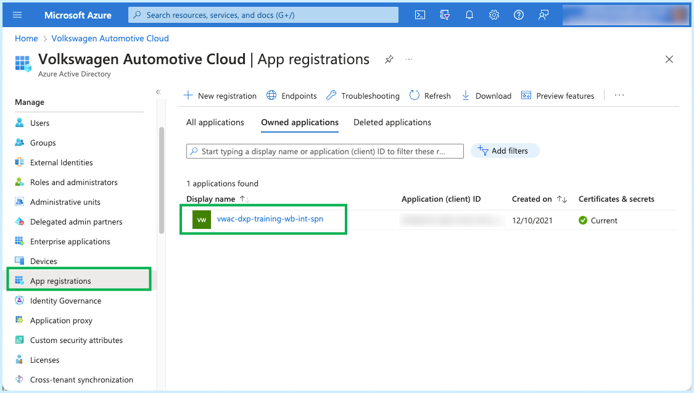
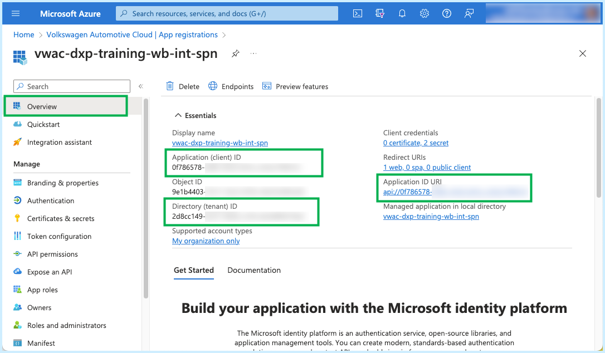
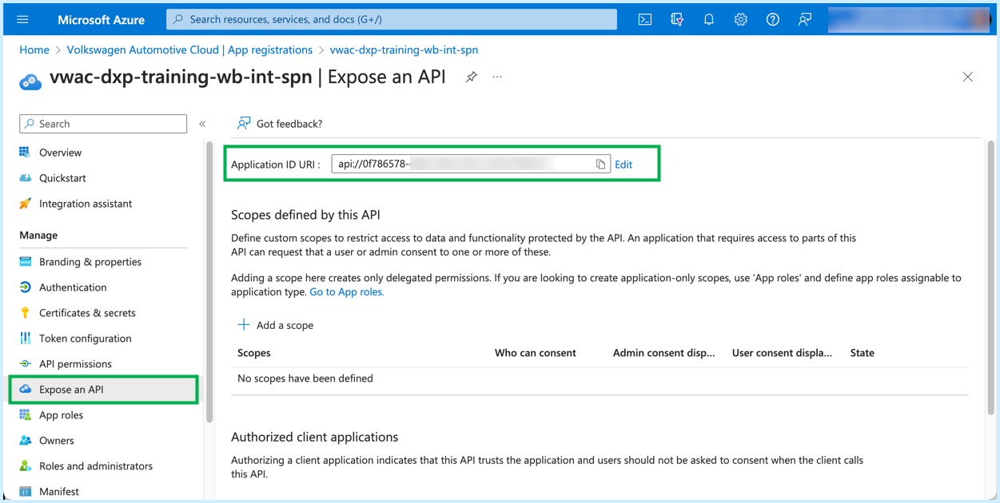
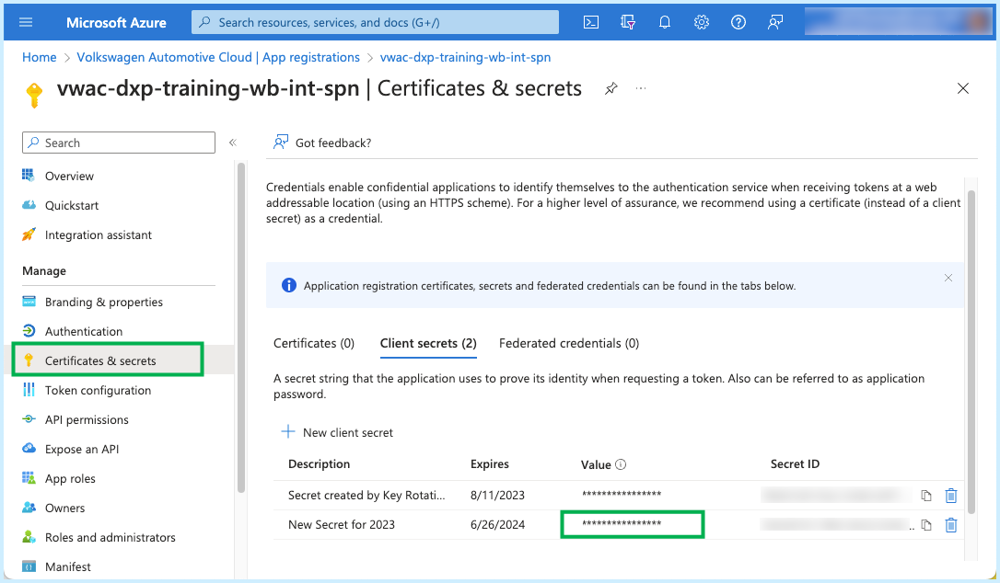
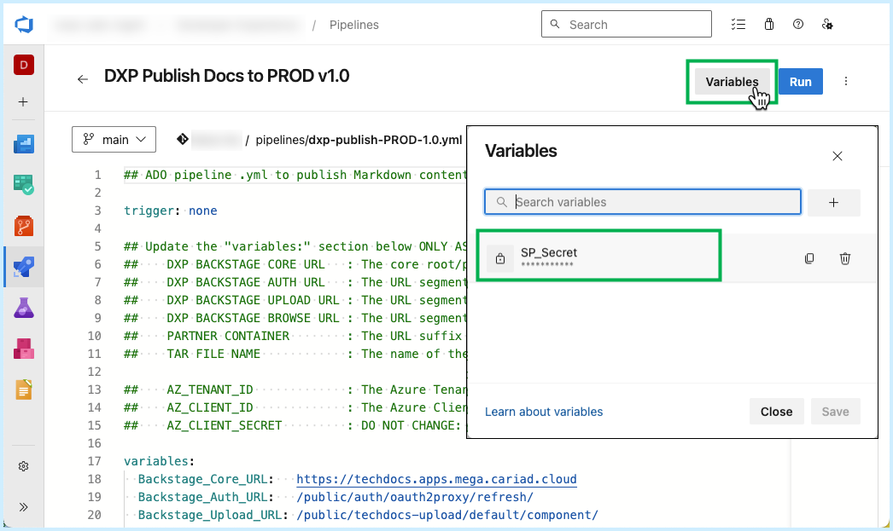
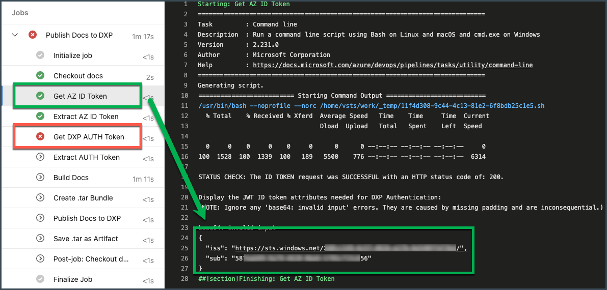
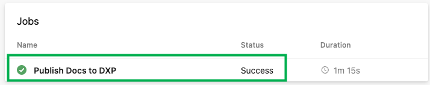

This article describes how to configure an **Azure DevOps (ADO) Repository** as a publishing source for Markdown content destined for Backstage.

The instructions below make reference to the files that can be found in the [Docs Sample Repository](sample-docs-repo.md)


## Authentication & Token Exchange

The XELERATE uploading process for TechDocs content requires the use of a two-stage token exchange. 

This exchange provides the following security benefits:

1. Authenticates each unique user and/or pipeline process.

  - This step ensures only approved pipelines can publish Docs.

2. Authorizes specific permissions and scopes for each user/process.

  - This step ensures that an approved pipeline user can *only* write to the System, Components and/or API's that its Team owns (not another team's).

This article describes the steps required to successfully conduct the dual token exchanges, and covers the details of the workflow found within the working sample CI/CD pipeline `.yml` file that is provided in the Docs Sample Repo (and at the end of this article).

### ADO: Token Exchange using Azure Service Principals (or App Registrations)

In a token exchange, the requester (e.g., the ADO pipeline) will request an **ID Token** using its local development environment's token issuer (Azure). The pipeline will use that token to authenticate with an Authentication server (e.g., XELERATE's AUTH service). 

Once authenticated successfully, the XELERATE AUTH service will return an **Access Token** which the ADO pipeline can then use to upload its Docs (as a bundle of all its website files):


Obtaining a valid ID Token for use in an ADO pipeline requires that you leverage a **Service Principal** or an **App Registration** from within your Azure tenant.

!!! note
    If you do not have an active Service Principal or App Registration, you must create one first. Contact your your IT/SecOps department for assistance.

### ADO: Obtaining your Tenant ID, Client ID, and Client Secret

Once you have located an appropriate Service Principal or App Registration:

1. Login into your tenant's Azure Portal and navigate to your Service Principal or App Registration.

  - Select **Azure Active Directory**.

  - Click on **App Registrations**.

  - Locate and click on your specific App Registration.

  

2. Select **Overview** and copy your App Registration or Service Principal's **Client ID** and **Tenant ID**.

  

3. Ensure **Application ID URI** has an API exposed.

  In the image above, note that the **Application ID URI** has an entry starting with `api://0f786578...`

  This is an exposed API that corresponds to the `scope:` entry that will be used in the token request's cURL command. 
  
  In our example, the exposed API `scope:` uses the exact same ID as the App Registration's Client ID.

  Ensure that you have an `api://` entry listed there. If not, create one from the **Expose an API** page:

  

4. If needed, click on **Certificates & secrets** and create (and copy) a new Client Secret

  

5. The last step is to post your Client Secret as a masked variable within your ADO pipeline.

  - Create (or edit) the ADO Pipeline that is associated with the `dxp-publish-PROD-X.X.yml` file

  - Click **Variables** and create a **new** variable named `SP_Secret`.

  **Note:** You should choose "Keep this value secret" when creating the variable. The specific name `SP_Secret` is used in the pipeline `.yml` described in the following sections.

  


## ADO: Core Pipeline Commands

The core commands needed in an ADO pipeline to achieve the token exchange and successfully generate and upload a `.tar` bundle for publishing to XELERATE are as follows:

| Description                                                   | ADO Pipeline Example Commands |
|---------------------------------------------------------------|-------------------------------|
| Generate an ID Token from an Azure SPN or App                 | `curl https://login.microsoftonline.com/$(AZ_Tenant_ID)/oauth2/v2.0/token -X POST -H 'Content-Type: application/x-www-form-urlencoded' -d 'grant_type=client_credentials' -d 'client_id=$(AZ_Client_ID)' -d 'scope=$(AZ_Scope_URI)/.default' -d 'client_secret=$(AZ_Client_Secret)' -o idtoken.response.json`
| Extract the ID Token from the response                        | `echo "##vso[task.setvariable variable=AZ_ID_Token;]$(jq .access_token idtoken.response.json)"`
| Request an Access Token from XELERATE's AUTH service  | `curl $(Backstage_Core_URL)$(Backstage_Auth_URL) -H "Authorization: Bearer $(AZ_ID_Token)" -o auth.response.json`
| Extract the Access Token from the response                    | `echo "##vso[task.setvariable variable=DXP_Auth_Token;]$(jq .backstageIdentity.token auth.response.json)"`
| Build the website from the .MD content                        | `npx @techdocs/cli build`
| Bundle the `./site` files into a .tar file                    | `tar -czvf $(Tar_File_Name) -C ./site .`
| Publish the .tar website to XELERATE's UPLOAD service | `curl $(Backstage_Core_URL)$(Backstage_Upload_URL)$(Partner_Container) -X PUT -H "Authorization: Bearer $(DXP_Auth_Token)" -F "file=@$(Tar_File_Name);type=application/gzip" -o upload.response.json`

See [below](#ado-complete-pipeline-script) for the complete pipeline script.


## Running the Pipeline

To successfully run the ADO pipeline to publish your Docs to Backstage, all of the following prerequisites must have been completed:

1. Created a `catalog-info.yaml` file with your primary entity (System or Component) that will be associated with your Docs.

2. Added that entity into Backstage successfully.

3. Configured your Docs repo with all the necessary contents, including:

  - A Docs folder with .md files and images
  - An `mkdocs.yml` file (your Docs Table of Contents)
  - An `index.md` file (your Docs home page)

4. With these in place, run your pipeline for the first time.

  !! YOU SHOULD RECEIVE AN ERROR !!

  

  If the "Get AZ ID Token" step was successful, you should see your ISS & SUB fields displayed in the Pipeline run.

  Even though that ID Token is valid, when it is evaluated by the Backstage AUTH service, no associated user is found, and a 404 error is returned in the very next step:

  `{"error":{"name":"NotFoundError","message":"User not found"},"request":{"method":"GET","url":"/public/auth/oauth2proxy/refresh/"},"response":{"statusCode":404}}`

5. Contact the XELERATE Admin Team.

  - Send them your ISS & SUB information.
  - Ask them to create a user for you. 

6. Once that user has been added, re-run the workflow.

  It should run successfully and completely:

  


## ADO: Complete Pipeline Script

Below is the complete text of the `dxp-publish-PROD-3.2.yml` from the Docs Sample Repo for ADO pipelines.

It is a fully-functional example (with added comments and output helpers) of a workflow from Azure DevOps that you can copy, edit, and use in your own development environment's CI/CD process.

!!! tip "Important"
    Please work with your XELERATE onboarding contact to ensure you have all the necessary parameters correct.

In most cases you should *only* make changes to the following variables. 

- Changing your container type (System or Component):

  - Line 23: `Backstage_Upload_URL: /public/techdocs-upload/default/system/`

  - Line 24: `Backstage_Browse_URL: /docs/default/system/`

- Replace `EXAMPLE` with your assigned container name:

  - `Partner_Container: EXAMPLE`

  - `Tar_File_Name: EXAMPLE_website.tar.gz`

- Enter your Docs Root folder (if necessary), and add your Azure App Registration's Client ID, Tenant ID, and Scope URI:

  - `Docs_Root_Folder: "."`

  - `AZ_Tenant_ID: XXXXXXXX-XXXX-XXXX-XXXX-XXXXXXXXXXXX`

  - `AZ_Client_ID: XXXXXXXX-XXXX-XXXX-XXXX-XXXXXXXXXXXX`

  - `AZ_Scope_URI: api://XXXXXXXX-XXXX-XXXX-XXXX-XXXXXXXXXXXX`

**Note:** This v3.2 workflow has been tested and validated using ADO as of February, 2024.

```{.yaml linenums="1"}
## Pipeline: ADO pipeline .yml to publish Markdown content to XELERATE using TechDocs
## Version:  3.2

trigger: none

## Update the "variables:" section below ONLY AS DIRECTED: 
##    DXP BACKSTAGE CORE URL   : The core root/prefix for DXP's Backstage instance hosted in Megatron.
##    DXP BACKSTAGE AUTH URL   : The URL segment used by DXP's Backstage Auth Service.
##    DXP BACKSTAGE UPLOAD URL : The URL segment used by DXP's Backstage Back End Upload Service.
##    DXP BACKSTAGE BROWSE URL : The URL segment used to browse to the finished Docs site.
##    DOCS ROOT FOLDER         : Change this if your "docs" folder is NOT located at the root of your Repo.
##    PARTNER CONTAINER        : The URL suffix identifying the Partner's Container name.
##    TAR FILE NAME            : The name of the .tar file this script will create and upload to the DXP.

##    AZ_TENANT_ID             : The Azure Tenant ID for your Service Principle.
##    AZ_CLIENT_ID             : The Azure Client ID for your Service Principle.
##    AZ_SCOPE_ID              : The Azure Application ID URI.
##    AZ_CLIENT_SECRET         : DO NOT CHANGE: The Service Principle Secret is extracted from a PIPELINE VARIABLE.

variables:
  Backstage_Core_URL:   https://developer.cariad.digital/
  Backstage_Auth_URL:   /public/auth/oauth2proxy/refresh/
  Backstage_Upload_URL: /public/techdocs-upload/default/system/
  Backstage_Browse_URL: /docs/default/system/
  
  Docs_Root_Folder:     "."
  Partner_Container:    EXAMPLE
  Tar_File_Name:        EXAMPLE_website.tar.gz

  AZ_Tenant_ID:         XXXXXXXX-XXXX-XXXX-XXXX-XXXXXXXXXXXX
  AZ_Client_ID:         XXXXXXXX-XXXX-XXXX-XXXX-XXXXXXXXXXXX
  AZ_Scope_URI:         api://XXXXXXXX-XXXX-XXXX-XXXX-XXXXXXXXXXXX
  AZ_Client_Secret:     $(SP_Secret)

jobs:
  - job: publish_docs_to_dxp
    displayName: 'Publish Docs to DXP'

    pool:
      vmImage: ubuntu-latest

## Get an ID Token from an Azure Service Principle:

    steps:
    - script: |
        HTTP_STATUS=$(curl https://login.microsoftonline.com/$(AZ_Tenant_ID)/oauth2/v2.0/token \
          -X POST \
          -H 'Content-Type: application/x-www-form-urlencoded' \
          -d 'grant_type=client_credentials' \
          -d 'client_id=$(AZ_Client_ID)' \
          -d 'scope=$(AZ_Scope_URI)/.default' \
          -d 'client_secret=$(AZ_Client_Secret)' \
          -o idtoken.response.json \
          -w "%{http_code}")

        if [ "$HTTP_STATUS" = 200 ]; then
          echo -e "\nSTATUS CHECK: The ID TOKEN request was SUCCESSFUL with an HTTP status code of: $HTTP_STATUS.\n"
        else
          echo -e "\nSTATUS FAIL: The ID TOKEN request FAILED with an HTTP status code of: $HTTP_STATUS."
          if [ "$HTTP_STATUS" = 401 ]; then
            echo -e "\nThe full response was:"
            cat idtoken.response.json

            echo -e "\n"
            echo -e ">>> An HTTP 401 'Unauthorized' response code may indicate that the Azure Service Principal/App failed to authenticate your account."
            echo -e ">>> Double check the following variables in your pipeline:"
            echo -e ">>>  - 'AZ_Tenant_ID' = $(AZ_Tenant_ID)"
            echo -e ">>>  - 'AZ_Client_ID' = $(AZ_Client_ID)"
            echo -e ">>>  - 'AZ_Scope_URI' = $(AZ_Scope_URI)"
            echo -e ">>>  - 'SP_Secret'    = Did you remember to make this variable?"
            echo -e ">>> Contact your DXP representative for additional assistance.\n"
          fi
          exit 1
        fi

        ## Use the `jq` command to isolate the response's token.
        ID_Token=$(jq .access_token idtoken.response.json)

        echo -e "Display the JWT ID token attributes needed for DXP Authentication:"
        echo -e "(Note: Ignore any 'base64: invalid input' errors. They are caused by missing padding and are inconsequential.)\n"
        echo $ID_Token | cut -d '.' -f 2 | base64 -d | jq '{iss: .iss, sub: .sub}'

      displayName: 'Get AZ ID Token'
      name: 'Get_AZ_ID_Token'

## Extract the Azure ID Token:

    - script: | ## Note: The "setvariable" command must be in its own step.
            echo "##vso[task.setvariable variable=AZ_ID_Token;]$(jq .access_token idtoken.response.json)"
      displayName: 'Extract AZ ID Token'
      name: Extract_AZ_ID_Token

## Retrieve an Auth Token from DXP's Backstage Auth Service:

    - script: |
        HTTP_STATUS=$(curl $(Backstage_Core_URL)$(Backstage_Auth_URL) \
          -H "Authorization: Bearer $(AZ_ID_Token)" \
          -o auth.response.json \
          -w "%{http_code}")

        if [ "$HTTP_STATUS" = 200 ]; then
          echo -e "\nSTATUS CHECK: The DXP AUTH TOKEN request was SUCCESSFUL with an HTTP status code of: $HTTP_STATUS.\n"
        else
          echo -e "\nSTATUS FAIL: The DXP AUTH TOKEN request FAILED with an HTTP status code of: $HTTP_STATUS.\n"
          if [ "$HTTP_STATUS" = 401 ]; then
            echo -e "\nThe full response was:"
            cat auth.response.json

            echo -e "\n"
            echo -e ">>> An HTTP 401 'Unauthorized' response code may indicate that the DXP's Backstage Authentication service couldn't authenticate your account."
            echo -e ">>> Double check the entity values in your 'catalog-info.yml' file:"
            echo -e ">>>  - {ISS}"
            echo -e ">>>  - {SUB}"
            echo -e ">>> Contact your DXP representative for additional assistance.\n"
          fi
          exit 1
        fi

        ## Use the `jq` command to extract the HTTP response code (if any).
        Backstage_Response_Code=$(jq '.response.statusCode' auth.response.json)

      displayName: 'Get DXP AUTH Token'
      name: 'Get_DXP_Auth_Token'

## Extract the Backstage Auth Token:

    - script: | ## Note: The "setvariable" command must be in its own step.
        echo "##vso[task.setvariable variable=DXP_Auth_Token;]$(jq .backstageIdentity.token auth.response.json)"
      displayName: 'Extract AUTH Token'
      name: Extract_AUTH_Token

## Build the Website from the .MD Content into a "site" Folder:

    - script: |
        echo -e "\nCMD: 'npm --version'. Ensure 'npm' is installed..."
        npm --version

        echo -e "\nCMD: 'pwd'. Display the REPO Root folder"
        pwd

        echo -e "\nCMD: 'ls -l'. Display the REPO Root contents."
        ls -l

        echo -e "\nCMD: 'cd $(Docs_Root_Folder)'. Change to the DOCS Root folder (if any)."
        cd $(Docs_Root_Folder)

        echo -e "\nCMD: 'pwd'. Display the DOCS Root folder."
        pwd

        echo -e "\nCMD: 'ls -l'. Display the DOCS Root folder contents prior to BUILDING the web site.\n"
        ls -l

        if [ -f "docs/index.md" ]; then
          echo -e "\nSTATUS CHECK: The '/docs/index.md' file was FOUND. Continuing with the BUILD process."
        else
          echo -e "\nSTATUS FAIL: The '/docs/index.md' file is MISSING. Halting the BUILD process."
          exit 1
        fi

        echo -e "\nBuilding the website using TechDocs."
        echo -e "(Note: You can ignore warnings from the TechDocs CLI output)."
        echo -e "\nCMD: 'npx @techdocs/cli build\n'."
        npx @techdocs/cli build

        echo -e "\nCMD: 'ls -l'. Once finished, the BUILD process should add a new 'site;' folder containing the generated .HTML files:\n"
        ls -l

        if [ -d "site" ]; then
          echo -e "\nSTATUS CHECK: The 'site' folder was FOUND. The BUILD process appears to have been SUCCESSFUL."
        else
          echo -e "\nSTATUS FAIL: The 'site' folder is MISSING. Halting the BUILD process."
          exit 1
        fi
      
      displayName: 'Build Docs'
      name: Build_Docs

## Bundle the "site" files into a .tar:

    - script: |

        echo -e "\nCMD: 'pwd'. Display the REPO Root folder"
        pwd

        echo -e "\nCMD: 'ls -l'. Display the REPO Root contents."
        ls -l

        echo -e "\nCMD: 'cd $(Docs_Root_Folder)'. Change to the DOCS Root folder (if any)."
        cd $(Docs_Root_Folder)

        echo -e "\nCMD: 'pwd'. Display the DOCS Root folder."
        pwd

        echo -e "\nCMD: 'ls -l'. Display the DOCS Root folder contents prior to BUNDLING the files into a .tar.\n"
        ls -l

        echo -e "\nBundle the SITE folder into a .tar archive file."
        echo -e "\nCMD: 'tar -czvf $(Tar_File_Name) -C ./site .'."
        tar -czvf $(Tar_File_Name) -C ./site .
          
        ## Note: This directory display will show the file size of the .tar file.
        echo -e "\nCMD: 'ls -l'. The new .tar file, $(Tar_File_Name), should now be visible in the folder.\n"
        echo -e "Note: Take notice of the .tar file's SIZE! (0-20 bytes = too small, wrong directory?)"
        ls -l

        if [ -f "$(Tar_File_Name)" ]; then
          echo -e "\nSTATUS CHECK: The $(Tar_File_Name) TAR bundle file was FOUND. The BUNDLE process appears to finish with no errors."
        else
          echo -e "\nSTATUS FAIL: The $(Tar_File_Name) TAR bundle file is MISSING. Halting the BUNDLE process."
          exit 1
        fi

      displayName: 'Create .tar Bundle'
      name: Create_Tar

## Publish the '.tar' to the DXP's Storage Depot:
##  - Send an HTTP command to upload the .tar file.
##  - Direct the response into an output file called 'upload.response.json'.

    - script: |
        echo -e "\nCMD: 'pwd'. Display the Repo Root folder"
        pwd

        echo -e "\nCMD: 'ls -l'. Display the Repo Root contents."
        ls -l

        echo -e "\nCMD: 'cd $(Docs_Root_Folder)'. Change to the Docs Root folder (if any)."
        cd $(Docs_Root_Folder)

        echo -e "\nCMD: 'pwd'. Display the Docs Root folder."
        pwd

        echo -e "\nCMD: 'ls -l'. Display the Docs Root folder contents prior to BUNDLING the files into a .tar...\n"
        ls -l

        HTTP_STATUS=$(curl $(Backstage_Core_URL)$(Backstage_Upload_URL)$(Partner_Container) \
          -X PUT \
          -H "Authorization: Bearer $(DXP_Auth_Token)" \
          -F "file=@$(Tar_File_Name);type=application/gzip" \
          -o upload.response.json \
          -w "%{http_code}")

        if [ "$HTTP_STATUS" = 200 ]; then
          echo -e "\nSTATUS CHECK: The PUBLISH process was SUCCESSFUL with an HTTP status code of: $HTTP_STATUS."
        else
          echo -e "\nSTATUS FAIL: The PUBLISH process FAILED. Received an HTTP status code of: $HTTP_STATUS."
          if [ "$HTTP_STATUS" = 403 ]; then
            echo -e "\nThe full Upload Response was:\n"
            cat upload.response.json
            
            echo -e ">>> An HTTP 403 'Forbidden' response code indicates that the Backstage Auth service found your account ('iss:sub'),"
            echo -e ">>> but it was NOT allowed to publish to your specified partner container ('$(Partner_Container)')"
            echo -e ">>> or its entity type (e.g., 'container', 'system', etc)."
            echo -e ">>> Contact your DXP representative and ask them to inspect the entities in the appropriate 'catalog-info.yml' file."

          fi
          exit 1
        fi

        STATUS=$(jq -r '.status' upload.response.json)

        if [ "$STATUS" = "ok" ]; then
          echo -e "STATUS CHECK: Upload was successful, you can now see your content in the DXP!"
          echo -e "Browse to: $(Backstage_Core_URL)$(Backstage_Browse_URL)$(Partner_Container)\n"
        else
          echo -e "STATUS FAIL: Upload failed with a status of: $STATUS\n"
          exit 1
        fi

      displayName: 'Publish Docs to DXP'
      name: 'Publish_Docs'

## (Optionally) Publish the .tar bundle as an artifact to the pipeline run:
##  - Set 'condition: true' to post the .tar file as a pipeline artifact.
##  - Set 'condition: false' to skip this task.

    - task: PublishPipelineArtifact@1
      displayName: 'Save .tar as Artifact'
      condition: false
      inputs:
        targetPath: '$(Docs_Root_Folder)/$(Tar_File_Name)'
        artifactName: 'DXP Docs Website Tar File'
        publishLocation: 'pipeline'
```
