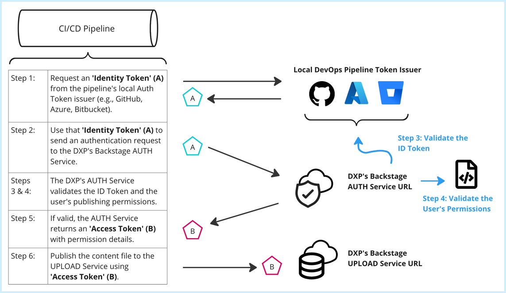
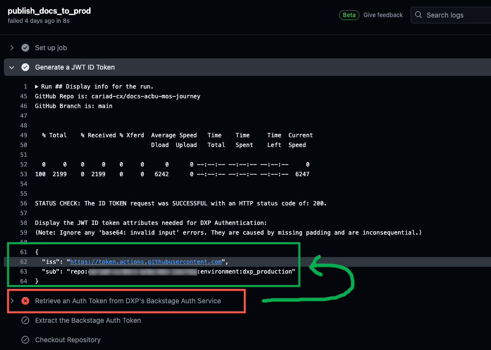
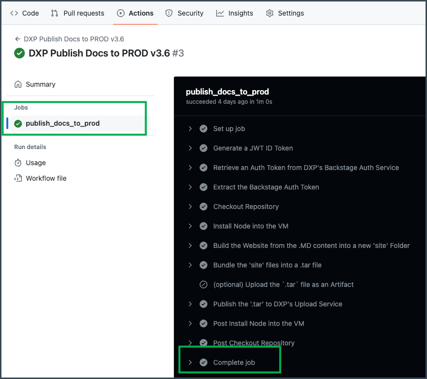

This article describes how to configure a **GitHub.com Repository** as a publishing source for Markdown content destined for Backstage.

The instructions and details below refer to the files that can be found in the [Docs Sample Repository](./sample-docs-repo.md)


## Authentication & Token Exchange

The XELERATE uploading process for TechDocs content requires the use of a two-stage token exchange.

This exchange provides the following security benefits:

1. Authenticates each unique user and/or pipeline process.

  - This step ensures only approved pipelines can publish Docs.

2. Authorizes specific permissions and scopes for each user/process.

  - This step ensures that an approved pipeline user can *only* write to the System, Components and/or API's that its Team owns (not another team's).

This article describes the steps required to successfully conduct the dual token exchanges, and covers the details of the workflow found within the working sample CI/CD pipeline `.yml` file that is provided in the Docs Sample Repo (and at the end of this article).

### GitHub.com: Token Exchange using OpenID Connect

!!! note
    See GitHub's [Security Hardening with OpenID Connect](https://docs.github.com/en/actions/deployment/security-hardening-your-deployments/about-security-hardening-with-openid-connect) article for more information.

In an OpenID Connect token exchange, the requester (e.g., the GitHub CI/CD workflow) will request an **ID Token** using its local development environment's OIDC token issuer (GitHub.com).

The workflow will use that token to authenticate with an Authentication server (e.g., the XELERATE AUTH service).

Once authenticated successfully, the XELERATE AUTH service will return an **Access Token** which the GitHub workflow can then use to upload its Docs (as a bundle of all its website files):




## GitHub.com: Core Workflow Commands

The core commands needed in a GitHub.com workflow to achieve the token exchange and successfully generate and upload a `.tar` bundle for publishing to XELERATE are as follows:

| Description                                                   | GitHub.com Workflow Example Commands |
|---------------------------------------------------------------|--------------------------------------|
| Generate an OIDC JWT ID Token from GitHub                     | `GitHub_Token=$ACTIONS_ID_TOKEN_REQUEST_TOKEN`
| Request an Access Token from XELERATE's AUTH service  | `curl ${AUTH_URL} -H "Authorization: Bearer ${GitHub_Token}" -o Backstage_Response.json`
| Extract the Access Token from the response                    | `Backstage_Token=$(jq '.backstageIdentity.token' Backstage_Response.json)`
| Build the website from the .MD content                        | `npx @techdocs/cli build`
| Bundle the `./site` files into a .tar file                    | `tar -czvf $(Tar_File_Name) -C ./site .`
| Publish the .tar website to XELERATE's UPLOAD service | `curl -H "Authorization: Bearer ${Backstage_Token}" ${UPLOAD_URL} -X PUT -F "file=@$my.web_site.tar.gz;type=application/gzip"`

See [below](#githubcom-complete-workflow-script) for the complete workflow script.


## Running the Workflow

To successfully run the GitHub workflow to publish your Docs to Backstage, all of the following prerequisites must have been completed:

1. Created a `catalog-info.yaml` file with your primary entity (System or Component) that will be associated with your Docs.

2. Added that entity into Backstage successfully.

3. Configured your Docs repo with all the necessary contents, including:

  - A Docs folder with .md files and images
  - An `mkdocs.yml` file (your Docs Table of Contents)
  - An `index.md` file (your Docs home page)

4. With these in place, run your workflow for the first time.

  !! YOU SHOULD RECEIVE AN ERROR !!

  

  If the "Generate a JWT ID Token" step was successful, you should see your ISS & SUB fields displayed in the Pipeline run.

  Even though that ID Token is valid, when it is evaluated by the Backstage AUTH service, no associated user is found, and a 404 error is returned in the very next step:

  `{"error":{"name":"NotFoundError","message":"User not found"},"request":{"method":"GET","url":"/public/auth/oauth2proxy/refresh/"},"response":{"statusCode":404}}`

5. Contact the XELERATE Admin Team.

  - Send them your ISS & SUB information.
  - Ask them to create a user for you.

6. Once that user has been added, re-run the workflow.

  It should run successfully and completely:

  


## Github.com: Complete Workflow Script

Below is the complete text of the `dxp-publish-PROD-3.6.yml`. (A slightly enhanced version from the 3.5 version found in the Docs Sample Repo for GitHub.com workflows.)

It is a fully-functional example (with added comments and output helpers) of a workflow from GitHub.com that you can copy, edit, and use in your own development environment's CI/CD process.

!!! tip "Important"
    Please work with your XELERATE onboarding contact to ensure you have all the necessary parameters correct.

In most cases you should *only* make changes to the following variables:

- Changing your container type (System or Component):

  - Line 21: `Backstage_Upload_URL: public/techdocs-upload/default/system/`

  - Line 22: `Backstage_Browse_URL: docs/default/system/`

- Replacing `EXAMPLE` with your assigned container name:

  - Line 23: `Partner_Container: EXAMPLE`

  - Line 24: `Tar_File_Name: EXAMPLE_website.tar.gz`

**Note:** This v3.6 workflow has been tested and validated using GitHub.com as of April, 2024.

```{.yaml linenums="1"}
## Pipeline: GitHub.com workflow .yml to publish Markdown content to Backstage using TechDocs
## Version:  3.6

name: XELERATE Publish Docs to PROD v3.6

on:  workflow_dispatch

## Update the variables in the "env:" section below ONLY AS DIRECTED:
##    BACKSTAGE CORE URL   : The core root/prefix for XELERATE's Backstage instance hosted in Megatron.
##    BACKSTAGE AUTH URL   : The URL segment used by XELERATE's Backstage Auth Service.
##    BACKSTAGE UPLOAD URL : The URL segment used by XELERATE's Backstage Back End Upload Service.
##    BACKSTAGE BROWSE URL : The URL segment used to browse to the finished Docs site. Usually ending in "system" or "component".
##    PARTNER CONTAINER    : The URL suffix identifying the Partner's Container name.
##    TAR FILE NAME        : The name of the .tar file this script will create and upload to the XELERATE.
##    REPO ROOT FOR DOCS   : Path from the root of your repo to the folder containing the "docs" folder. Use "." if "docs" is at the root.
##    REPO DOCS FOLDER     : Name of your "docs" folder in your "Repo_Root_for_Docs" folder.

env:
  Backstage_Core_URL:  https://developer.cariad.digital/
  Backstage_Auth_URL:   public/auth/oauth2proxy/refresh/
  Backstage_Upload_URL: public/techdocs-upload/default/system/  ## CHANGE AS INSTRUCTED
  Backstage_Browse_URL: docs/default/system/                    ## CHANGE AS INSTRUCTED
  Partner_Container:    EXAMPLE                                 ## CHANGE AS INSTRUCTED
  Tar_File_Name:        EXAMPLE_website.tar.gz                  ## CHANGE AS INSTRUCTED
  Repo_Root_for_Docs:   .                                       ## CHANGE IF "docs" is not in the root of your repo
  Repo_Docs_Folder:     docs                                    ## CHANGE IF "docs" is not the name of your Docs folder

permissions:
  id-token: write   ## Required for requesting the JWT (JSON Web Token) ID Token.
  contents: read    ## Required for actions/checkout.

jobs:
  publish_docs_to_prod:
    runs-on: ubuntu-latest

    ## The "environment" value should be set to `dxp_production` when using GitHub.com.
    ## !! DO NOT CHANGE !!
    ## This Environment, along with the Repo name and the workflow's ID Token, are used by the Backstage Auth Service to validate the requestor.

    environment: dxp_production

    steps:
      - name: Generate a JWT ID Token
        id: generate_id_token
        run: |
          ## Display info for the run.
          echo -e "GitHub Repo is: $GITHUB_REPOSITORY"
          echo -e "GitHub Branch is: $GITHUB_REF_NAME"
          echo -e "\n"

          ## Generate an ID Token (using GitHub actions) using an HTTP cURL command.
          ## Direct the response into an output file called `idtoken.response.json`.
          HTTP_STATUS=$(curl "$ACTIONS_ID_TOKEN_REQUEST_URL" -H "Authorization: Bearer $ACTIONS_ID_TOKEN_REQUEST_TOKEN" -o idtoken.response.json -w "%{http_code}")

          if [ "$HTTP_STATUS" = 200 ]; then
            echo -e "\n\nSTATUS CHECK: The ID TOKEN request was SUCCESSFUL with an HTTP status code of: $HTTP_STATUS.\n"
          else
            echo -e "\n\nSTATUS FAIL: The ID TOKEN request FAILED with an HTTP status code of: $HTTP_STATUS.\n"
            exit 1
          fi

          ## Use the `jq` command to isolate the response's token.
          GitHub_Token=$(jq -r '.value' idtoken.response.json)

          ## Make the GitHub_Token accessible in other named steps.
          echo "GitHub_Token=$GitHub_Token" >> $GITHUB_OUTPUT

          echo -e "Display the JWT ID token attributes needed for XELERATE Authentication:"
          echo -e "(Note: Ignore any 'base64: invalid input' errors. They are caused by missing padding and are inconsequential.)\n"
          echo ${GitHub_Token} | cut -d '.' -f 2 | base64 -d | jq '{iss: .iss, sub: .sub}'

          ## !!! THESE "DISPLAY THE TOKEN" LINES SHOULD ONLY BE ENABLED DURING INITIAL TESTING !!!
          ##   GitHub tries very hard to prevent tokens/secrets from being displayed to the console, displaying '***' instead.
          ##   Therefore, in order to SEE/COPY the token, we can show it in two parts.
          # echo -e "\nThe full GitHub Response is:"
          # cat idtoken.response.json
          # echo -e "\n\nThe GitHub-generated ID token for this run is the combination of: \n"
          # echo ${GitHub_Token:0:5} "... Plus ..." ${GitHub_Token:5}

      - name: Retrieve an Auth Token from XELERATE's Backstage Auth Service
        id: retrieve_auth_token
        run: |
          ## Send an HTTP cURL command to the Backstage_Auth_URL using the GitHub ID Token generated above.
          ## Direct the response into an output file called `auth.response.json`.
          HTTP_STATUS=$(curl ${Backstage_Core_URL}${Backstage_Auth_URL} -H "Authorization: Bearer " -o auth.response.json -w "%{http_code}")

          if [ "$HTTP_STATUS" = 200 ]; then
            echo -e "\nSTATUS CHECK: The DXP AUTH TOKEN request was SUCCESSFUL with an HTTP status code of: $HTTP_STATUS."
          else
            echo -e "\nSTATUS FAIL: The DXP AUTH TOKEN request FAILED. Received an HTTP status code of: $HTTP_STATUS."
            exit 1
          fi

          ## Use the `jq` command to extract the HTTP response code (if any).
          Backstage_Response_Code=$(jq '.response.statusCode' auth.response.json)

          ## Display the HTTP Response Code and the full HTTP response.
          echo -e "\nDisplay the Backstage Response Code: $Backstage_Response_Code"
          echo -e "(Note: The Response Code should be 'NULL'. NULL = no errors.)"
          echo -e "\nThe Complete Backstage Response is as follows:"
          echo -e "(Note: The Backstage Token in the response, if present, will be redacted by GitHub as ***)\n"
          cat auth.response.json

          # VALIDATE: On Auth token failure STOP HERE, else CONTINUE TO NEXT STEP.
          if [ $Backstage_Response_Code == 401 ]; then
            echo -e "\n\nERROR: Terminating Run - Received HTTP status code $Backstage_Response_Code.\n"
            exit 1
          fi

      - name: Extract the Backstage Auth Token
        id: extract_auth_token
        run: |
          ## Use the `jq` command to extract the Backstage Access Token from the response.
          DXP_Auth_Token=$(jq '.backstageIdentity.token' auth.response.json)

          ## Make the DXP_Auth_Token variable accessible to other named steps.
          echo "DXP_Auth_Token=$DXP_Auth_Token" >> $GITHUB_OUTPUT

          ## !!! THESE "DISPLAY THE TOKEN" LINES SHOULD ONLY BE ENABLED DURING INITIAL TESTING !!!
          # echo -e "\nThe extracted Backstage Auth Token for this run is the combination of: \n"
          # echo ${DXP_Auth_Token:0:5} "... Plus ..." ${DXP_Auth_Token:5}

      - name: Checkout Repository
        uses: actions/checkout@v4

      - name: Install Node into the VM
        ## Node is required to run the Techdocs CLI command in the following step.
        uses: actions/setup-node@v4
        with:
          node-version: '20'

      - name: Build the Website from the .MD content into a new 'site' Folder
        id: build_site
        run: |
          echo -e "\nCMD: 'pwd'. Display the repo's current working directory."
          pwd

          echo -e "\nCMD: 'cd $Repo_Root_for_Docs'. Change to the folder containing the '$Repo_Docs_Folder' directory."
          cd $Repo_Root_for_Docs

          echo -e "\nCMD: 'pwd'. Display the repo's current working directory."
          pwd

          echo -e "\nCMD: 'ls -l'. Display the folder's contents prior to BUILDING the web site. \nYou should see the '$Repo_Docs_Folder' folder here:\n"
          ls -l

          if [ -f "$Repo_Docs_Folder/index.md" ]; then
            echo -e "\nSTATUS CHECK: The '$Repo_Docs_Folder/index.md' file was found. Continuing with the BUILD process."
          else
            echo -e "\nSTATUS FAIL: The '$Repo_Docs_Folder/index.md' file is missing. Halting the BUILD process."
            exit 1
          fi

          if [ $Repo_Docs_Folder != 'docs' ]; then
            echo -e "\nImportant: Your 'docs' folder has ben changed to: '$Repo_Docs_Folder'."
            echo -e "\nImportant: Be sure to ALSO change your 'mkdocs.yaml' file to: 'docs_dir: $Repo_Docs_Folder'."
          fi

          echo -e "\nBuilding the HTML website using TechDocs."
          echo -e "(Note: You can ignore warnings from the TechDocs CLI output)."
          echo -e "\nCMD: 'npx @techdocs/cli build'.\n"
          npx @techdocs/cli build

          echo -e "\nCMD: 'ls -l'. Once finished, the BUILD process should add a new 'site' folder containing the generated .HTML files:\n"
          ls -l

          if [ -d "site" ]; then
            echo -e "\nSTATUS CHECK: The 'site' folder was found. The BUILD process was SUCCESSFUL."
          else
            echo -e "\nSTATUS FAIL: The 'site' folder is missing. Halting the BUILD process."
            exit 1
          fi

      - name: Bundle the 'site' files into a .tar file
        id: create_tar
        run: |
          echo -e "\nCMD: 'cd $Repo_Root_for_Docs'. Change to the folder containing the '$Repo_Docs_Folder' directory."
          cd $Repo_Root_for_Docs

          echo -e "\nCMD: 'ls -l'. Display the folder's contents prior to BUNDLING the files into a .tar.\n"
          ls -l

          echo -e "\nBundle the 'site' folder into a .tar archive file."
          echo -e "CMD: 'tar -czvf $Tar_File_Name -C ./site .'.\n"
          tar -czvf $Tar_File_Name -C ./site .

          ## Note: This directory display will show the file size of the .tar file.
          echo -e "\nCMD: 'ls -l'. The new .tar file, $Tar_File_Name, should now be visible in the folder."
          echo -e "Note: Take notice of the .tar file's SIZE! (0-20 bytes = too small, wrong directory?)\n"
          ls -l

          if [ -f "$Tar_File_Name" ]; then
            echo -e "\nSTATUS CHECK: The $Tar_File_Name TAR bundle file was found. The BUNDLE process finished with no errors."
          else
            echo -e "\nSTATUS FAIL: The $Tar_File_Name TAR bundle file is missing. Halting the BUNDLE process."
            exit 1
          fi

      - name: (optional) Upload the `.tar` file as an Artifact
        ## Set this `if` statement to `true` to make the .tar file available as an artifact in the pipeline run.
        ## Set to `false` to skip this step.
        if: false
        id: artifact_tar
        uses: actions/upload-artifact@v4
        with:
          name: Bundled Website .tar File
          path: /

      - name: Publish the '.tar' to XELERATE's Upload Service
        id: publish_tar
        run: |
          ## Use an HTTP cURL command to upload the .tar file.
          ## Direct the response into an output file called `upload.response.json`.
          HTTP_STATUS=$(curl ${Backstage_Core_URL}${Backstage_Upload_URL}${Partner_Container} -X PUT -H "Authorization: Bearer " -F "file=@$Repo_Root_for_Docs/$Tar_File_Name;type=application/gzip" -o upload.response.json -w "%{http_code}")

          if [ "$HTTP_STATUS" = 200 ]; then
            echo -e "\nSTATUS CHECK: The PUBLISH process was SUCCESSFUL with an HTTP status code of: $HTTP_STATUS.\n"
          else
            echo -e "\nSTATUS FAIL: The PUBLISH process FAILED. Received an HTTP status code of: $HTTP_STATUS.\n"
            if [ "$HTTP_STATUS" = 403 ]; then
              echo -e "\nThe full Upload Response was:\n"
              cat upload.response.json

              echo -e "\n"
              echo -e ">>> An HTTP 403 'Forbidden' response code indicates that the Backstage Auth service found your Backstage User account (i.e., Your 'iss|sub' matched),"
              echo -e ">>> but it was NOT allowed to publish to your specified partner container ('$Partner_Container')"
              echo -e ">>> or it was NOT allowed to publish to its entity type (e.g., 'container' vs. 'system', etc)."
              echo -e ">>> Work with your XELERATE representative for assistance in inspecting the entities in the appropriate 'catalog-info.yml' file."

            fi
            exit 1
          fi

          STATUS=$(jq -r '.status' upload.response.json)

          if [ "$STATUS" = "ok" ]; then
            echo -e "STATUS CHECK: Upload was SUCCESSFUL, you can now see your content in the DXP!"
            echo -e "Browse to: ${Backstage_Core_URL}${Backstage_Browse_URL}${Partner_Container}\n"
          else
            echo -e "STATUS FAIL: Upload FAILED with a status of $STATUS\n"
            exit 1
          fi
```
