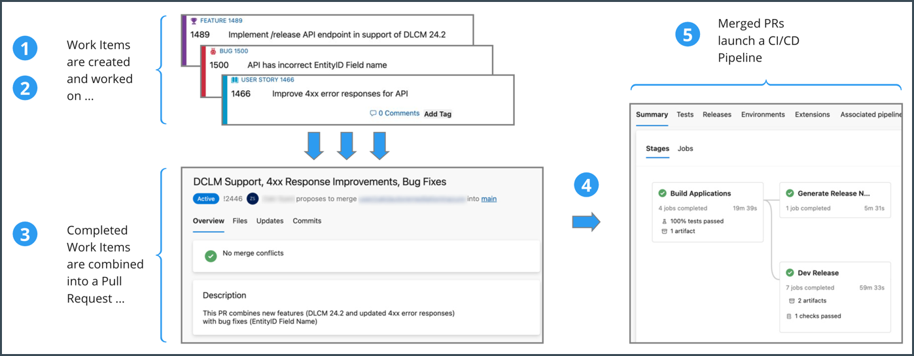
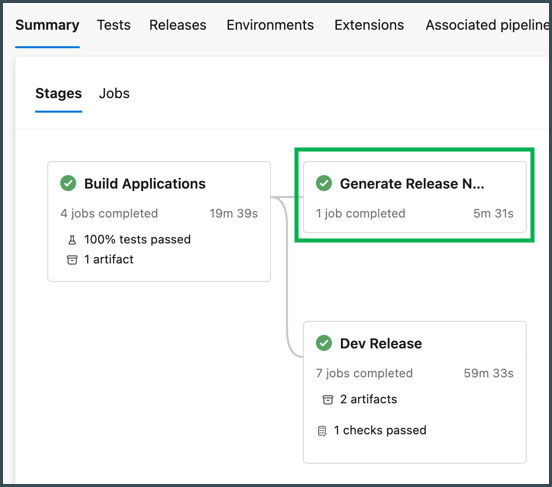
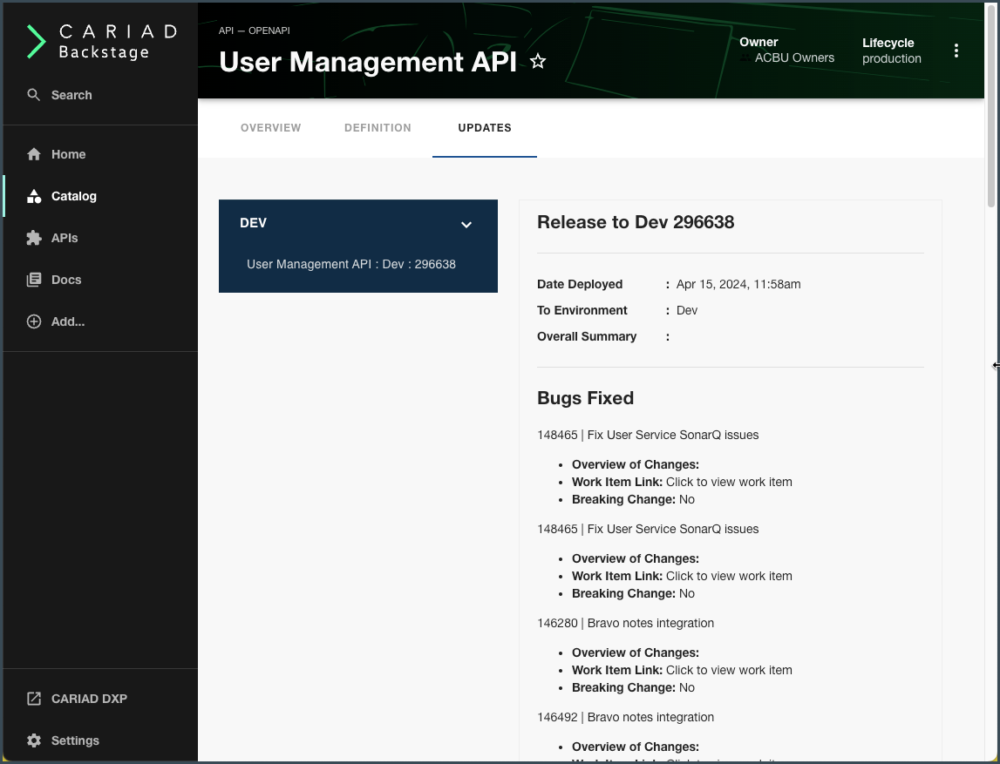

## Introduction

Starting in early 2024, the Backstage Development team added a new set of capabilities for the publishing of Release Notes into Backstage.

This new set of features allows a team to publish content about each new update they deploy to their API or Service.

The articles in this section outline the concepts, flows, processes, and provide detailed steps to implement these Release Note publishing features. 

## Overview

There are two arenas of work to be aware of when you consider publishing Release Notes to your API or Service in XELERATE:

- The aspects related to: Code Development, Release Management, and Pipeline runs
- The process of: Creating and Publishing Release Notes to Backstage

### Code Development, Release Management, and Pipeline runs

At a high level, the development and deployment of new code for a team's APIs or Services might follow a process similar to the following steps:

1. **Work Items** are created within a DevOps environment (like ADO, GitHub, Jira, etc.). Those Work Items might include **Bugs**, **Features**, **User Stories**, etc.

2. A development team builds and tests their code, adding new features and capabilities, and fixing bugs.

3. When ready for final review and deployment, a **Pull Request** (PR) is created. The PR provides a general overview of the updated release, and is associated to all the relevant/resolved User Stories, Features, and Bugs. 

4. Once reviewed and approved, the PR gets merged back into the repo's main branch and is then ready to be deployed.

5. In a CI/CD environment, the merging of the PR into the main branch will automatically kick off a pipeline (or workflow/action) which automates all the steps necessary to deploy the new code to the target environment (Dev, Int, Approval, Live, etc.)

For Release Note content to be useful and beneficial, the following tasks must be enforced in the Release Management process for your API or Service:

- Release Note-related fields *must be present* (or added) in each work item type (Bug, User Story, etc.).
- Those work item fields *must be populated* with accurate information (which will be extracted for inclusion in the release note).
- The PR should have a useful description summary, and the PR must reference all the associated work items.
- Approved and merged PRs must initiate an automated deployment pipeline.
- The CI/CD pipeline must be enhanced with the "Create and Publish" steps (outlined in the next sections).

### Creating and Publishing Release Notes to Backstage

Once your API development team has all the above release management aspects in place, the "Publish Release Notes to Backstage" steps can be added.

The release note publishing steps listed below can be implemented via a "Generate Release Notes" job which can be added into your deployment pipeline:

The "Generate Release Notes" job implements the following concepts:

1. Collect all the Release Note-related content from the PR and all of its associated Work Items.

  - Release Note Content extracted from the **Pull Request**:
    - Deployment Date
    - Version of the new API (ex.: 1.2.3)
    - Environment deployed to (ex.: INT, VAL, LIVE)
    - An Overall Summary Description of the release
    - The API/Service that is being deployed (ex.: the "User Management API")
  
  - Release Note Content extracted from each **Work Item**:
    - Title
    - ID/Number
    - URL of the Work Item (for internal reference)
    - Description of the work performed
    - Type of Work Item: Bug, User Story, etc.
    - Whether this item is a "Breaking Change" or not
    - Service Request or DXP Ticket # (if externally reported)

2. Combine all the Release Note Content into a single JSON file.

  - The content must conform to a predefined **JSON schema** for Release Notes (see below).

3. Store the Release Note JSON file.

  - The Release finished Note JSON file is commonly stored as an artifact within the pipeline run itself.

4. Authenticate to the Backstage AUTH Service.

5. Publish the JSON file using a XELERATE API Endpoint.

When successful, the new Release Note will be received by Backstage, stored as a new entity of `kind: ReleaseNote` and will be rendered in the **UPDATES** Menu for its API:

## Next Steps

The steps for [extracting content and creating the Release Note JSON](./rn-02.md) and for [publishing it to Backstage](./rn-03.md) are described in the next articles.
