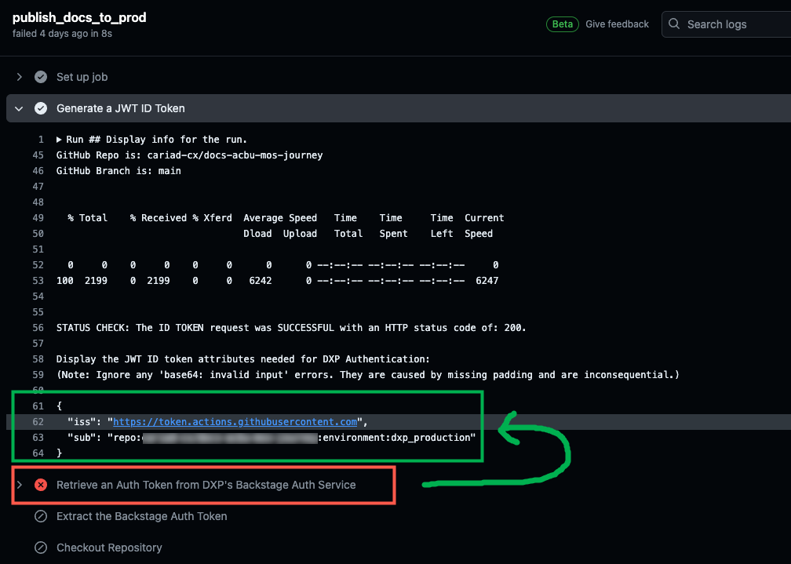

# Publishing JSON Release Notes to Backstage via ZIP

Once all the Release Note content has been placed into a JSON file, you can publish that JSON file to Backstage using endpoints in the XELERATE Public API.

The API will validate and, if necessary, refuse any file that doesn't conform properly to the schema. Any failed upload attempt will receive a response with an explanation of the failure. Correct your JSON and re-upload the file.

!!! note
    See the [Schema Definitions (v1)](./rn-02.md#json-schema) section in the **Content Extraction & JSON Creation** article for full schema details.

## XELERATE APIs used for Release Note Publishing

There are five [XELERATE Public APIs]( https://developer.cariad.digital/catalog/default/api/backstage-public-api/definition) that will be leveraged as part of the Release Note publishing process:

** Release Note-related APIs:**

| Method | Endpoint                | Description |
|--------|-------------------------|-------------|
| GET    | Get Static File         | This API is used to download the JSON schema details.
| GET    | Generate a Token        | This API is called to authenticate your Pipeline as being an authorized publisher. A Backstage Access Token is returned.
| POST   | Upload a Release Note using .zip    | Once authorized, this API is used to post a *new* release note.   This same API is used to *update* (overwrite) an existing release note with newer content.
| DELETE | Delete a Release Note   | Use this API to remove a release note from Backstage.

## Download the JSON Schema

You can download and analyze the complete JSON schema definition as described in the [JSON Schema](./rn-02.md#json-schema) section in the **Content Extraction & JSON Creation** article

### Content Producer Flow

1. Content Producers **CREATE** and edit their Release note content using  [release/release.json](https://developer.cariad.digital/public/static/schemas/release-note/v1/schema.json) files.

2. The JSON .zip content file is stored in the Content Producer's development Repo (GitHub, ADO, BitBucket, etc.)

3. Once the content is ready to be published, the Content Producer will run a CI/CD Pipeline/Workflow to:

  - Initiate a **BUILD** process, converting their ZIP files into JSON files and storing the generated JSON and send this to entiries structure.

## Authentication Using a Two-Step Token Exchange

The processes and authentication flow for publishing **Release Notes** follows nearly the same procedures as publishing **TechDocs**.

!!! note
    For complete details on publishing TechDocs see:

    - [TechDocs Publishing](guide-publishing.md)
    - [Publishing Markdown from GitHub.com](publish-via-github.md)
    - [Publishing Markdown from Azure ADO](publish-via-ado.md)

Like publishing TechDocs, the uploading process for publishing a Release Note requires the use of a two-stage token exchange.

This exchange provides the following security benefits:

1. Authenticates each unique user and/or pipeline process.

  - This step ensures only approved pipelines can publish content (like Docs or Release Notes).

2. Authorizes specific permissions and scopes for each user/process.

  - This step ensures that an approved pipeline user can *only* write to the Systems, Components, and/or API's that its Team owns (not another team's).

To initiate the process, the publisher (e.g., your CI/CD pipeline) will request an **ID Token** using its local development environment's token issuer (GitHub, Azure, etc.). Your pipeline will use that ID token to authenticate with the XELERATE's AUTH service.

Once authenticated, the Backstage AUTH service will return an **Access Token** which your pipeline then uses to upload and publish the Release Note JSON file.

For additional details on ID Tokens, and to download sample pipeline scripts, see the following articles:

- For **ADO pipelines** see: [Publishing from Azure ADO](./publish-via-ado.md#authentication--token-exchange).

- For **GitHub workflows** see: [Publishing from GitHub.com](./publish-via-github.md#authentication--token-exchange).

## Pipeline Authentication: Issuer & Subject

Once your pipeline is in place and run for the first time,  ***!! YOU SHOULD RECEIVE AN ERROR !!***. 

If the "Generate a JWT ID Token" step was successful, you should see your **Issuer** and **Subject** fields displayed in the Pipeline run.

Even though that ID Token is valid, when it is evaluated by the Backstage AUTH service, no associated user is found, and a 404 error is returned in the very next step:

`{"error":{"name":"NotFoundError","message":"User not found"},"request":{"method":"GET","url":"/public/auth/oauth2proxy/refresh/"},"response":{"statusCode":404}}`

Contact the XELERATE Admin Team.

- Send them your ISS & SUB information.
- Ask them to create a user for you.

## Publishing Your JSON-based Release Note

Once the initial Token Exchange has occurred, and the XELERATE team has added your {ISS|SUB} user, you can use the the [Upload a new release note]( https://developer.cariad.digital/catalog/default/api/backstage-public-api/definition#/default/upload) API endpoint (PUT /public/release-notes) to publish your JSON file to Backstage.

The API will validate the file against the predefined schema and, if necessary, refuse any file that doesn't conform properly.

### Requirements for `affectedService`

Your JSON file must have an `affectedService` string.

Your `affectedService` string must conform to the following format `{backstage-namespace}/{entity-kind}/{entity-name}` as defined below:

| Term                    | Definition                             | Details |
| ------------------------|----------------------------------------|---------|
| `{backstage-namespace}` | Namespace within XELERATE.     | Currently only `default` is supported
| `{entity-kind}`         | Kind of entity you are publishing to.  | Currently only `api` is supported
| `{entity-name}`         | The exact `name:` used by your entity. | Example: `acbu-mdc-signal-sensitivity`

This means that your `affectedService` string must look like the following: `default/api/{api-name}`

### The `ReleaseNote` Entity

When successfully published, the new Release Note will be received by Backstage and stored as a new entity of `kind: ReleaseNote`.

Each published Release Note is stored with a unique name aggregated from three elements:

- The API's entity **name** (ex.: `acbu-mdc-service`)
- The **environment** it was deployed to (ex.: `INT`)
- The **version** of the API's deployment (ex.: `9.9.34`)

Therefore, the full name of the entity in the above example would be: `acbu-mdc-service-INT-9.9.34`

All Release Note entities can be seen by choosing "kind: Release Note" in the XELERATE Software Catalog:

-https://developer.cariad.digital/catalog?filters%5Bkind%5D=releasenote

!!! tip "Important"
    The custom `ReleaseNote` entity is was created as a storage area for the raw JSON content. Viewing a Release Note entity has little value by itself.

    Instead, viewing Release Notes for an API is done using a custom-made rendering component.

    Access an API's Release Notes via the [UPDATE Menu](https://developer.cariad.digital/catalog/default/api/acbu-mdc-service/updates/acbu-mdc-service-INT-9.9.34) on an individual API entity.

## Viewing Your Release Notes

To view the actual Release Note from the above examples, click this URL;

-https://developer.cariad.digital/catalog/default/api/acbu-mdc-service/updates/acbu-mdc-service-INT-9.9.34

A custom rendering component developed by the XELERATE team is used to display all the Release Notes for a particular API in the API's UPDATE Menu.

Best practices for accessing Release Notes include the following tips:

1. Looking for all Release Notes for a specific API?

  - Navigate to the API entity first, then click on the API's UPDATE menu.

2. Looking for an API from a particular System or Component?

  - Navigate to the System or Component, scroll down and click on the desired API:

  

## Deleting a Release Note Entity

Use the [Delete a release note](https://developer.cariad.digital/catalog/default/api/backstage-public-api/definition#/default/delete) API endpoint (DELETE /public/release-notes/{name}) to delete a specific Release Note entity from Backstage.

Remember: The name of each specific Release Note entity is a combination of the name, environment, and version.

For example: `acbu-mdc-service-INT-9.9.34`

!!! Note
    If you have trouble deleting a Release Note, reach out to the Backstage Admin team and they can "unregister" the entity for you.

    Provide the specific URL/Link to the exact entity you want them to remove:

    Example of a Backstage Admin unregistering a Release Note entity on behalf of a user:

    
