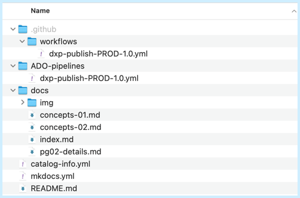
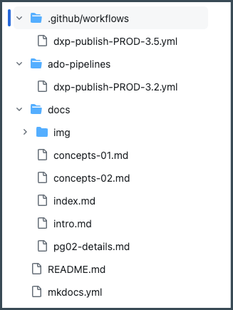
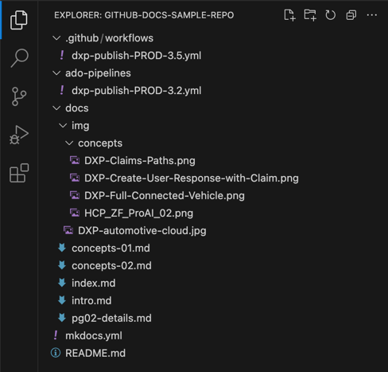
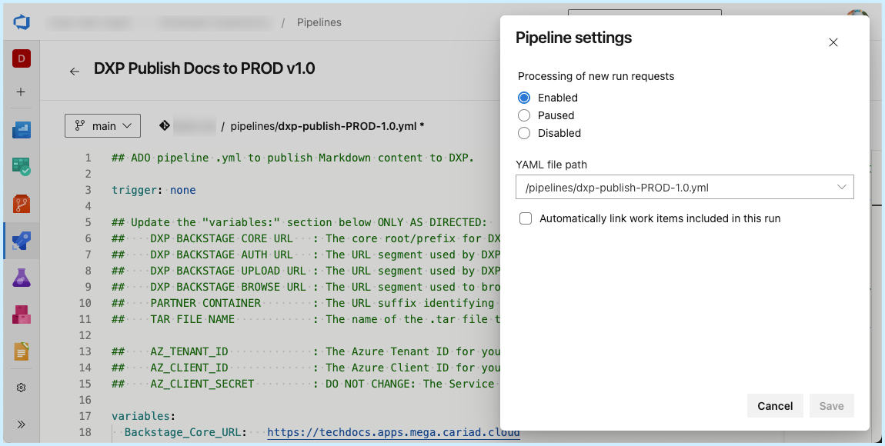

A sample documentation repository has been provided to assist you with testing and validating your TechDocs installation.

This **Docs Sample Repo** contains all the necessary MkDocs and TechDocs configuration files for you to BUILD, PREVIEW, and PUBLISH Docs content.

1. Click the .ZIP file to download the Docs Sample Repo (v3.5) to your local computer's hard drive: 

  - <a href="../files/docs-sample-repo-v3.5.zip" download>docs-sample-repo.zip</a>

  !!! note
      This Docs Sample Repo can *also* be found in CARIAD's GitHub.com organization: 
      
      - https://github.com/cariad-dxp/docs-sample-repo

2. Extract the contents of the .ZIP file and place them into your local code repo folder on your computer. 

  There you will find:

  Four Markdown (.MD) files with contents for four pages of a sample website:

  - `/docs/index.md`

  - `/docs/pg02-details.md`
    
  - `/docs/concepts-01.md`
      
  - `/docs/concepts-02.md`

  Several images located in folders within the `/docs` folder:
      
  - `/docs/img`
      
  - `/docs/img/concepts`

  A MkDocs configuration file:
      
  - `/mkdocs.yml`

  A Workflow file for use with GitHub.com Actions:

  - `.github/workflows/dxp-publish-PROD-3.5.yml`

  A Pipeline file for use with Azure DevOps (ADO):

  - `ado-pipelines/dxp-publish-PROD-3.2.yml`

  Below is a visual display of the files and folders found in the Docs Sample Repo:

  

  **Note:** If you do not see the hidden folder `/.github`:
    
  - On a Mac: Press **CMD + SHIFT + '.' (period)** to enable the display of hidden files and folders in Finder windows.
  
  - On a PC: Click the **View** tab in the File Explorer and tick the "Hidden items" checkbox.

3. The `mkdocs.yml` file contains configuration metadata and the Table of Contents (ToC) descriptors (`nav:`) that are used to build a complete website from the sample .MD files:

  **Sample `mkdocs.yml`:**

  ```{.yaml linenums="1"}
  site_name: My Project Name

  docs_dir: docs

  nav:
    - Home Page: index.md
    - Second Page: pg02-details.md
    - Sub-Head for Concepts:
      - Concepts Page 1: concepts-01.md
      - Concepts Page 2: concepts-02.md

  plugins:
    - techdocs-core
  ```

  | Parameter    | Description |
  |--------------|-------------|
  | `site_name:` | The displayed title for your Docs website.
  | `docs_dir:`  | The root directory where your Docs content is located.
  | `nav:`       | The layout containing the names and structure for your Table of Contents.

  Refer to the complete [MkDocs documentation](https://www.mkdocs.org/user-guide/writing-your-docs/) for additional details on `mkdocs.yml` formatting and parameters.


## Base Files for XELERATE Markdown Content used by TechDocs and MkDocs

There are a few files that must be present at the *root* of your Docs repo to enable the TechDocs and MkDocs components for proper building and publishing to XELERATE:

| Type   | Name              | Usage |
|--------|-------------------|-------|
| Folder | .github/workflows | Contains the CI/CD Workflow for a GitHub.com repo.
| File   | .github/workflows/dxp-publish-PROD-x.x.yml | A sample workflow that can be run manually to `build` and `publish` your repo's Docs from GitHub.com.
| Folder | ado-pipelines     | Contains the CI/CD pipeline for an ADO repo.
| File   | ado-pipelines/dxp-publish-PROD-x.x.yml | A sample pipeline that can be run manually to `build` and `publish` your repo's Docs from ADO.
| File   | README.md         | Template with a short description, ownership, usage, tags, etc. associated with your Docs content.
| File   | catalog-info.yml  | Config file used by Backstage's TechDocs. Contains the metadata needed by TechDocs for publishing entities into XELERATE.
| File   | mkdocs.yml        | Config file used by MkDocs for taking the markdown files found in this repo and rendering them into an HTML website. <br> Includes the `site_name`, the `docs_dir`, and a complete Table of Contents (ToC) descriptor tree for navigation (`nav`).


## Folder Structure for Documentation Content

For a content-only, Docs-oriented repo, your documentation content will typically be stored in a folder called `docs` at the root of your repo.

All images associated with all your Docs pages can be stored in a *single* image folder called `img` located within the `docs` folder.

### Example file and folder structure (GitHub.com Web UI):



### Example file and folder structure (VSCode):




### Customizing your `docs` and `img` folder names and locations

If your Docs and/or images are located alongside (or embedded deeper within) your source code repo, your folder names and locations may be different from  `/docs` and `/docs/img`. 

If so, change the `docs_dir: docs` line in your `mkdocs.yml` config file to specify the location and name of the _root_ of your documentation folder. Adjust your `.md` pages to properly reference image locations as needed.


## GitHub.com: Uploading the Sample Documentation Repo to a new Repo

Use an editing tool such as VSCode to deploy the Docs Sample Repo's files to a new repo in your GitHub.com environment.

Alternatively, you can make a new repo using the GitHub Web UI by following these steps:

!!! note
    See https://docs.github.com/en/repositories/working-with-files/managing-files/adding-a-file-to-a-repository for additional details.

1. Create a new empty repo in the GitHub Web UI.

2. Above the list of files, select the **Add file** dropdown menu and click **Upload files**.

3. Drag and drop the Docs Sample Repo files from your local drive.

4. Click **Commit changes**.

Ensure the hidden folders and workflow files were created successfully.


## ADO: Pipeline Creation

For Azure DevOps repos, you will need to manually create a new ADO Pipeline and connect its source to the `dxp-publish-PROD-X.X.yml` file for it be functional in your Azure DevOps tenant:




## Home Page via `index.md`

The contents of your `docs` folder will be converted from `.md` files into an HTML website via the tools from MkDocs and TechDocs CLI.

MkDocs requires that your initial home page be named `index.md` and be located in the root of your `/docs` folder.

Therefore, whichever page you want to use as your home/starting page (such as: `article-01.md`), it must be named/renamed `index.md`.

The names and locations of all other files can be whatever you choose.

For more details see: https://www.mkdocs.org/user-guide/writing-your-docs/


## Intro & Ownership Page via `intro.md`

To support the new DXP Front-end web pages, a new `intro.md` page should be added alongside your index.md home page.

This new file should contain (at a minimum) the following three sections:

- Introduction
- Ownership
- Support

The .md file will be converted to an .html file (during the BUILD process) but should *not* be included in your `mkdocs.yml` file.

The file will be extracted and displayed in the [Intro & Ownership Page](./intro-page.md) in the DXP's new Front-end.
