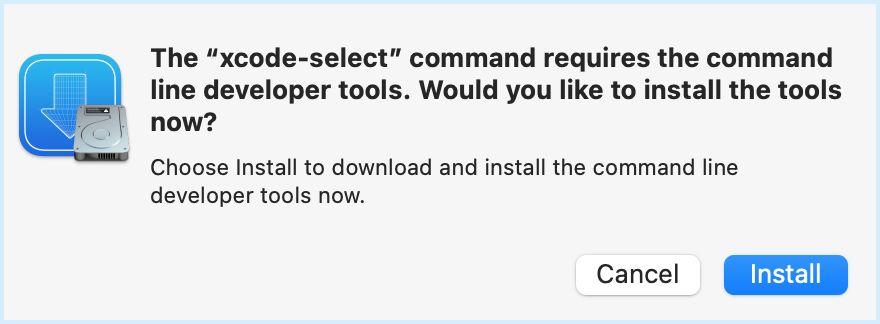
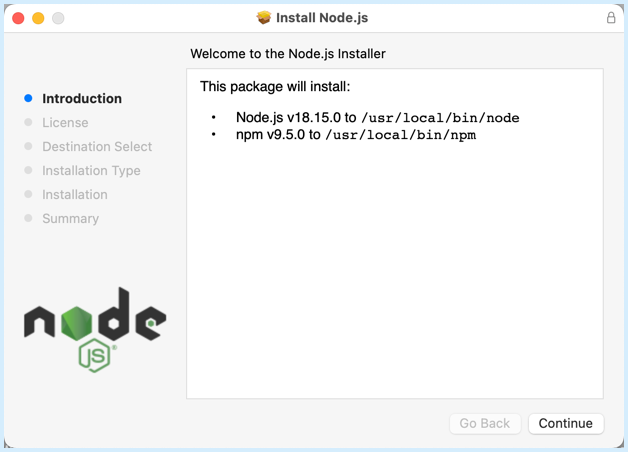
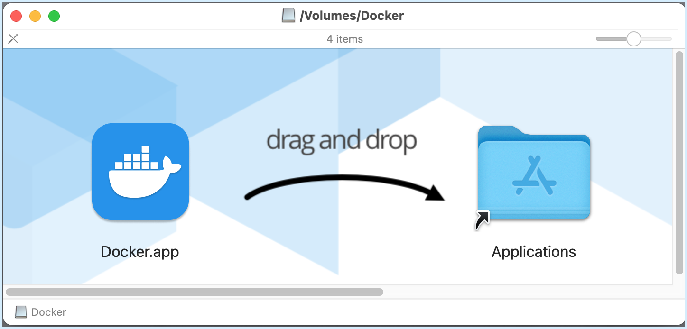
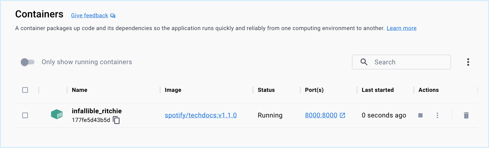
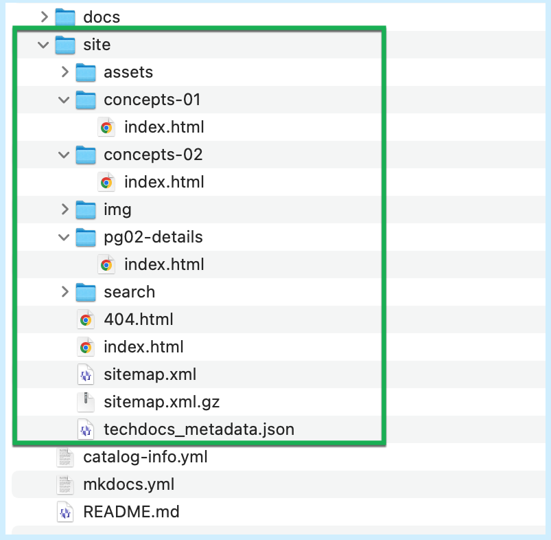
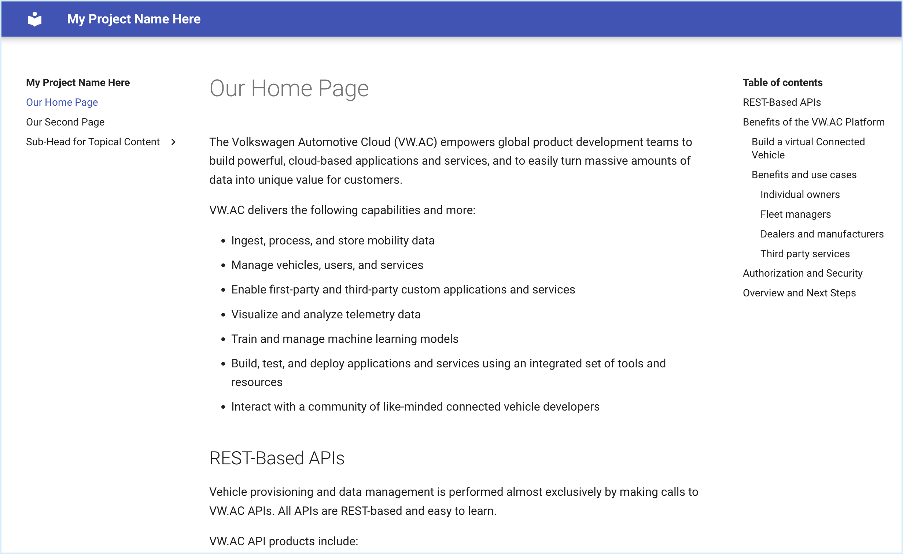
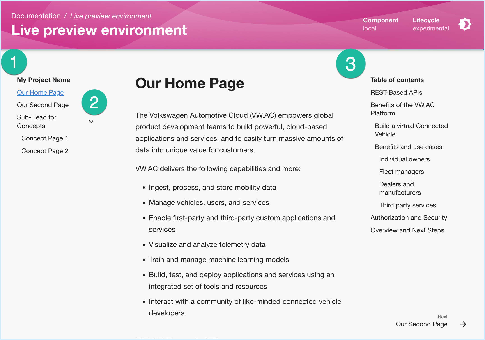

This article describes the necessary components and installation steps required to BUILD Markdown content and PREVIEW the .html website pages of your Docs on your local computer using the TechDocs CLI tool.


## Local Admin Rights are Required

You must have admin rights on your local computer to install these components.

If you do not have the administrative permissions to install these software components locally you can accomplish the same results using a variety of web-based tools and/or virtual-machine tools. Consider the following options:

- [GitHub Codespaces](https://docs.github.com/en/codespaces): A web-based development environment with compute-resources and console access hosted in the GitHub.com cloud.

- Any web-based development environment supporting pipelines, runners, containers, and web page viewers such as: [GitHub](https://github.com), [Azure DevOps](https://dev.azure.com), or Atlassian's [BitBucket](https://bitbucket.org).

- Any Virtual Machine (VM) that provides full administrative rights and installation permissions.


## Building and Previewing Markdown Content Locally by Installing the TechDocs CLI

Before you can use the BUILD and PREVIEW features of the TechDocs CLI on a local computer you must install the following prerequisite software on your computer (PC or Mac):

### Mac Prerequisites

1. Xcode Command Line Tools

2. Node.js & NPM

3. Docker Desktop

### PC Prerequisites

1. Node.js & NPM

2. Docker Desktop

The core Backstage [Getting Started](https://backstage.io/docs/getting-started/) documentation site and its listed [prerequisites](https://backstage.io/docs/getting-started/#prerequisites) should be referred to if you have additional configuration questions.

The Backstage [TechDocs CLI](https://backstage.io/docs/features/techdocs/cli) documentation pages can be used for additional details on the TechDocs CLI tool.

**Important:** You do _not_ need to install Backstage or create a Backstage App to use the TechDocs CLI to build, preview, or publish your Markdown content.

The instructions below will guide you through the installation steps for each of the necessary components and prerequisites to be able to BUILD and PREVIEW your Docs on your local computer.


## Prerequisite Software for Macs

Mac users will need to install the Xcode Command Line Tools.

First, check to see if the Xcode CLI tools are already installed on your Mac by using the following command:

- Display the **Xcode CLI** version with `pkgutil --pkg-info=com.apple.pkg.CLTools_Executables | grep version`:

  ```
  $ pkgutil --pkg-info=com.apple.pkg.CLTools_Executables | grep version
  
  version: 14.2.0.0.1.1668646533
  ```

If this command successfully displays a version, you can skip next section.


## Installing Xcode Command Line Tools on a Mac

The **Xcode Command Line Tools** package gives Mac Terminal users many of the tools and utilities that are commonly found in a default Linux installation (without having to install the entire Xcode package from Apple).

To install the Xcode CLI on your Mac, follow these steps:

!!! note
    More information and complete instruction can be found here: [How to Install Command Line Tools in Mac OS X](https://osxdaily.com/2014/02/12/install-command-line-tools-mac-os-x/).

1. Launch a Terminal window on your Mac (found in /Applications/Utilities/).

2. Enter the following command:

  `xcode-select --install`

3. A pop-up appears asking if you want to install the Xcode developer tools:

  
  
  - Click **Install**.

  - Then click **Agree** at the license agreement screen.

  Installation will take several minutes. 

The Xcode Command Line Toolkit package gets placed in the `/Library/Developer/CommandLineTools/` folder on your Mac.


## Additional Prerequisite Software for both PCs and Macs

Both PC and Mac users will need to install the following:

- Node.js & NPM

- Docker Desktop

Check to see if these tools are already installed on your local computer by using the following commands:

- Display the **npm** version with `npm --version`:

  ```
  $ npm --version
  
  9.5.0
  ```

- Display the Docker Desktop version with `docker --version`:

  ```
  $ docker --version
  
  Docker version 20.10.23, build 7155243
  ```

If both of these commands successfully show a version, then you can jump to the [Install the TechDocs CLI](#install-the-techdocs-cli) section below.

If any of these tools do _not_ display a version, proceed with the appropriate installation steps below.


## Install Node.js & NPM

!!! note
    More information and complete instruction can be found here: https://nodejs.org/en/download/package-manager.

To install Node.js & Node Package Manager (`npm`) on your PC or Mac, follow these steps:

1. Navigate to the Node.js installer download site: https://nodejs.org/en#home-downloadhead

2. Download the installer to your computer.

  **Note:** It is recommended that you install the LTS (Long Term Support) version.

3. Run the installer and proceed through the installation.

   

4. Verify that the Node.js Package Manager (`npm`) is installed by typing `npm --version`:

  ```
  $ npm --version
  
  9.5.0
  ```


## Install Docker Desktop

The TechDocs CLI requires Docker Desktop to activate the MkDocs BUILD process in order to convert your Markdown content into HTML content.

!!! note
    Although TechDocs technically has the ability to BUILD using a locally-installed version of MkDocs (rather than docker-based MkDocs code) it cannot do so when the repo is _also_ stored locally. If you choose to configure your local instance of the TechDocs CLI to grab from an *external* repo (e.g., GitHub, ADO, BitBucket, etc.) you may be able to forego the Docker Desktop install.

!!! info
    More information and complete instruction can be found here:

    - [Running Backstage Locally](https://backstage.io/docs/getting-started/running-backstage-locally)

    - [TechDocs Configuration Options](https://backstage.io/docs/features/techdocs/configuration)

**Mac Users:** To install Docker Desktop on your Mac, follow these steps:

1. Navigate to the Docker for Mac download site:

  - Mac: https://docs.docker.com/desktop/install/mac-install/

2. Select and download the correct version for your Mac hardware.

3. Double-click on the `Docker.dmg` disk image.

4. Drag the `Docker.app` into your Applications folder.

  

**PC Users:** To install Docker Desktop on your PC, follow these steps:

1. Navigate to the Docker for Windows download site:

  - PC: https://docs.docker.com/desktop/install/windows-install/

2. Click the "Docker Download for Windows" button to download the installer.

3. Run the `Docker Desktop Installer.exe`.

**PC and Mac Users:**

Once installed, you need to run the Docker App, accept the license agreement, and allow it to create links and update paths on your local computer.

With the Docker Desktop App installed and running, you can now proceed to:

- Install the TechDocs CLI.

- [Download a Sample Docs Site](./sample-docs-repo.md) to your local computer.

- Use the TechDocs CLI to BUILD and PREVIEW the sample Docs web site.


## Install the TechDocs CLI

With Node.js, `npm`, and Docker Desktop installed, you can now install the TechDocs CLI.

**Mac Users:**

For most Mac users, you will need to run the installation process using the `sudo` command to install as an administrative user (i.e., SuperUser).

1. In a Terminal window on your Mac, type `sudo npm install -g @techdocs/cli`:

  ```
  $ sudo npm install -g @techdocs/cli
  Password: xxxx

  [XXXXXXXXX..........] Downloading ... Installing ...

  npm WARN deprecated har-validator@5.1.5: this library is no longer supported.

  added 890 packages in 32s
  ```    

  The installation process will create the necessary directories and download the TechDocs CLI and its associated components into the `/usr/local/lib/node_modules/@techdocs` folder on your Mac. 

  **Note:** Ignore any notices and/or deprecation warnings for now. Act on the request for funding at your personal discretion.

**PC Users:**

1. In a Command window on your PC, type `npm install -g @techdocs/cli`:

  ```
  $ npm install -g @techdocs/cli

  [XXXXXXXXX..........] Downloading ... Installing ...

  npm WARN deprecated har-validator@5.1.5: this library is no longer supported.

  added 890 packages in 32s
  ```

**PC and Mac Users:**

 1. Verify that the TechDocs CLI is installed by typing `techdocs-cli --version`.

  ```
  $ techdocs-cli --version
  1.4.0
  ```


## Download a Sample Documentation Repo

Download and use a [sample documentation repository](./sample-docs-repo.md) to continue testing and validating your TechDocs CLI installation.


## Use TechDocs CLI to BUILD a Sample Web Site 

You can now use the TechDocs CLI to BUILD a web site using the sample config files, Markdown pages, and images from the Sample Docs Repo.

To build the sample web site, follow these steps:

1. Ensure Docker Desktop is running and active.

2. In a Terminal/Command window, navigate to the root of your Sample Docs repo on your local drive.

3. Enter the `techdocs-cli build` command:

  ```
  $ techdocs-cli build
  
  info: Using source dir /Users/UserName/Documents/Repos/docs-sample-mkdocs-repo-main
  info: Will output generated files in /Users/UserName/Documents/Repos/docs-sample-mkdocs-repo-main/site
  info: Generating documentation...
  info: Successfully generated docs from /Users/UserName/Documents/Repos/docs-sample-mkdocs-repo-main into /Users/UserName/Documents/Repos/docs-sample-mkdocs-repo-main/site using techdocs-container
  info: Done!
  ```

  If you monitor your Docker containers you will see the brief creation of a new Container that the TechDocs CLI activated to run the MkDocs Build process in:

  

The TechDocs CLI's BUILD process will:

- Activate a new Docker container to run the MkDocs build process.

- Create a new `/site` directory in the root of you Docs repo folder.

- Convert all your `.md` files into static `.html` pages.

- Create the necessary folder structure to match the Table of Contents specified in your `mkdocs.yml` file.

- Copy and rename _all_ your `*.md` files to `index.html` files and store each of them into the proper folder structure.

- Create the necessary website-oriented pages such as site maps, search and index files, style sheets, error pages, etc.

- Create the TechDocs metadata file: `techdocs_metadata.json`.

- Shut down the Docker container once the MkDocs build process is finished.

Browse the new `/site` folder to see the web pages:



You can double-click on any of the newly created `.html` files to preview that page in a local browser. The page content will display using the standard **MkDocs look-and-feel**:




## Use TechDocs CLI to PREVIEW your Sample Web Site 

Once you have confirmed that the BUILD process is working, you can instruct the TechDocs CLI to spin up a background web server process on your local computer to display and PREVIEW your entire web site including full navigation between pages.

**Note:** You must run `techdocs-cli build` *before* you can use `techdocs-cli serve`.

1. In a Terminal/Command window, navigate to the root of your Docs Sample Repo.

2. Enter the `techdocs-cli serve` command.

  ```
  $ techdocs-cli serve
  
  info: Starting mkdocs server.
  info: Serving docs in Backstage at http://localhost:3000/docs/default/component/local/
  Opening browser.
  ```

3. A new tab will open in your default web browser to display your Docs site using the standard **TechDocs look-and-feel**.

  The web server's pages can be previewed using a local URL: http://localhost:3000/docs/default/component/local/

  

  In the above diagram, notice:

  - (1) Your Site's Name (from the `mkdocs.yml` file).

  - (2) The Table of Contents (as defined in the `nav` section of the `mkdocs.yml` file).

  - (3) An auto-generated **Page Contents** on the right-hand side.

4. Dynamic Updates

  Notice also that the **MkDocs BUILD** Docker container remains active as long as the preview web server is running. This is because any changes you make to any of the source files will trigger a re-rendering of the pages by the MkDocs BUILD processor.

  For example:

  - Make a change to the content in one of the source Markdown pages (e.g., `concepts-01.md`) and save the changes.

  - Make a change to the `site_name` parameter in the `mkdocs.yml` file and save the changes.

  Refresh your browser's view after each change to see the updates.

5. Press `CTRL+C` to terminate the TechDocs' web server

  Be sure to press `CTRL+C` in the Terminal/Command window to shut down the TechDocs' web server and terminate the Docker Container.

When finished with your testing you should manually quit Docker Desktop.
